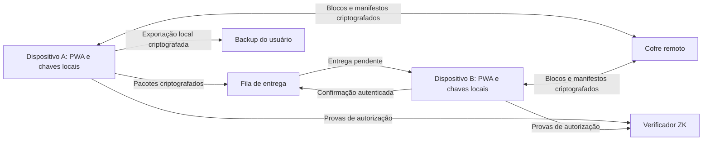

# 0xDMme — decisões e plano de implementação

Data: 29 de setembro de 2026  
Estado: bloco 00 concluído; seleção técnica e prova funcional do bloco 01 concluídas; base local web/PWA do bloco 02 implementada, com validação automatizada de persistência. Ainda não há aplicação de chat para dados reais.

Nome público aprovado em 01/10/2026: **0xDMme**. Domínio **0xdmme.app**, comprado pelo proprietário via **Namecheap**. Configurar HTTPS público válido em ambiente de teste isolado na infraestrutura própria para destravar os ensaios mobile. A identidade visual completa continua pendente; o domínio não representa lançamento do chat para dados reais.

Os nomes históricos da pasta/repositório e os identificadores técnicos `hash-talk`/`hash_talk` permanecem por compatibilidade com persistência, protocolos, configurações e ensaios aprovados. A alteração de marca não autoriza migrar chaves, cookies, bancos, formatos criptográficos ou identidade Git. [Configuração e pendências do domínio](docs/DOMINIO_E_AMBIENTE_TESTE.md).

## 1. Objetivo do produto

Construir um mensageiro privado acessível pela web, no computador e no celular, com perfil próprio, autenticação por wallet, experiência familiar de chat e interações úteis com blockchain.

O aplicativo será uma PWA: um site responsivo que também pode ser adicionado à tela inicial. Não dependerá de publicação em lojas de aplicativos.

O requisito central é que o backend não receba o conteúdo legível das conversas nem as chaves que permitem descriptografá-las. A criptografia acontece nos dispositivos. Provas de conhecimento zero serão usadas para reduzir as informações reveladas na autorização de determinadas operações.

**Princípio central do produto: PRIVACY FIRST.** Privacidade é requisito de arquitetura, implementação, experiência e aceite de cada recurso. Não reduzir criptografia, expor identificadores ou reter dados privados silenciosamente para facilitar desenvolvimento, desempenho, depuração ou lançamento. Quando houver conflito, preservar a proteção definida e explicitar a limitação funcional. Esse princípio não substitui o modelo de ameaças nem autoriza promessas de anonimato ou segurança absolutos.

Este documento registra o escopo, a arquitetura pretendida e a sequência de execução. Não representa software já implementado, auditado ou pronto para produção.

## 2. Decisões consolidadas

| Tema                          | Decisão                                                                                                                                                                                                                                                                                                                                  |
| ----------------------------- | ---------------------------------------------------------------------------------------------------------------------------------------------------------------------------------------------------------------------------------------------------------------------------------------------------------------------------------------- |
| Plataforma                    | Aplicação inteiramente web, responsiva e instalável como PWA.                                                                                                                                                                                                                                                                            |
| Identidade                    | Perfil próprio e identificador estável dentro do app; wallet como forma de autenticação.                                                                                                                                                                                                                                                 |
| Ecossistema inicial           | Login EVM e Solana na V1, conforme capacidades da wallet. Token do projeto provavelmente em Solana, ainda não decidido; elegibilidade de criação de grupos permanece separada da autenticação.                                                                                                                                           |
| Troca/recuperação de wallet   | Fora do escopo inicial. Isso não cancela recuperação do histórico/cofre com a wallet original e o segredo apropriado.                                                                                                                                                                                                                    |
| Perfil                        | Nome e foto editáveis; controles de visibilidade.                                                                                                                                                                                                                                                                                        |
| Contatos                      | Adicionar por wallet, atribuir apelido particular e manter agenda criptografada.                                                                                                                                                                                                                                                         |
| Cadastro prévio               | Permitir salvar uma wallet ainda não cadastrada; oferecer convite quando ela não estiver habilitada para mensagens.                                                                                                                                                                                                                      |
| Criptografia                  | Ponta a ponta por padrão, incluindo mensagens, arquivos e conteúdo privado dos status.                                                                                                                                                                                                                                                   |
| Histórico                     | Cofre pessoal completo dentro de cota e cofre próprio para cada grupo. Preservação criptografada; armazenamento local para desempenho e uso offline.                                                                                                                                                                                     |
| Dispositivos                  | Chaves e autorização próprias por dispositivo; sincronização entre aparelhos autorizados.                                                                                                                                                                                                                                                |
| Vinculação                    | Aprovação por aparelho existente via QR code/código, ou recuperação com segredo próprio.                                                                                                                                                                                                                                                 |
| Recuperação                   | Login com wallet recupera acesso à conta; recuperar conteúdo exige aparelho autorizado ou chave de recuperação.                                                                                                                                                                                                                          |
| Backup                        | Exportação e importação local de arquivo criptografado; inclusão de mídias selecionável.                                                                                                                                                                                                                                                 |
| Hash de backup                | Verificação auxiliar e registro opcional de versões; nunca única prova de legitimidade ou única condição de restauração.                                                                                                                                                                                                                 |
| Entrega offline               | Fila criptografada sem expiração automática para mensagens aceitas, com exceção explícita das mídias de grupo sujeitas à retenção rotativa, inclusive pendentes.                                                                                                                                                                         |
| Capacidade                    | Cota fixa inicial de 300 MB por conta, com controle de admissão. Não prometer armazenamento ou tráfego ilimitados.                                                                                                                                                                                                                       |
| Cofre cheio                   | Aviso antecipado, exportação/exclusão pelo usuário e bloqueio de novas aceitações que não possam ser preservadas. Nunca descartar silenciosamente mensagens já aceitas. Grupos terão cota própria, com regras detalhadas ainda propostas.                                                                                                |
| Contabilização                | Conteúdo pessoal consome os 300 MB da conta; conteúdo compartilhado de grupo usa o cofre próprio do grupo. Download em outro aparelho não duplica a cobrança lógica. Status libera espaço ao expirar.                                                                                                                                    |
| Cofre de grupo                | Decidido: 1 GB por grupo, compartilhado e criptografado, independente dos 300 MB pessoais. Divisão aprovada: 750 MB para mídias e 250 MB para texto/informações. Mídias podem expirar automaticamente, inclusive pendentes.                                                                                                              |
| Token e criação de grupos     | Token próprio planejado pelo proprietário. Criar grupos é condicionado ao saldo no momento da criação: 10.000 tokens = 2 grupos; 50.000 = 10; 100.000 = sem teto de tier. Rede/mint ainda pendentes. Capacidade global e controle de abuso continuam aplicáveis. Usuários gratuitos podem participar de grupos e usar as demais funções. |
| Exclusão                      | Separar apagar do aparelho, apagar do próprio cofre e solicitar exclusão para todos; não prometer eliminar cópias externas.                                                                                                                                                                                                              |
| Organizações                  | Emissor explícito e vínculo verificável com o projeto; assinatura de wallet desconhecida não concede selo de oficial.                                                                                                                                                                                                                    |
| Limite de grupos              | Começar com limite conservador, cujo número será definido após testes de sincronização/capacidade.                                                                                                                                                                                                                                       |
| Anexos iniciais               | Máximo fixo inicial de 3 MB por arquivo. Sem suporte inicial a upload/armazenamento de vídeos.                                                                                                                                                                                                                                           |
| Histórico de grupos           | Novos membros recebem mensagens posteriores à entrada; não têm acesso automático ao histórico anterior.                                                                                                                                                                                                                                  |
| Primeira versão pública       | Núcleo básico proposto, mais áudio gravado, grupos, status, ZK e presença/leitura configuráveis. Áudio, grupos, status e ZK são implementados depois do núcleo básico.                                                                                                                                                                   |
| Presença e leitura            | Online, visto por último e confirmação de leitura obrigatórios na V1, com controles individuais de privacidade.                                                                                                                                                                                                                          |
| Descoberta/visibilidade       | Endereço exato ou link/QR, sem diretório público; modo só por convite; solicitações antes do chat; foto para contatos aprovados e agenda particular.                                                                                                                                                                                     |
| Chamadas                      | Voz individual incluída como último recurso a implementar/testar na V1, depois de todo o restante do escopo. Ponta a ponta, TURN obrigatório, sem gravação ou histórico persistente da chamada. Voz em grupo e videochamadas continuam fora da V1.                                                                                       |
| Notificações                  | Web Push, som quando permitido, mute por conversa/grupo e bloqueio.                                                                                                                                                                                                                                                                      |
| Infraestrutura                | Operação própria, com possibilidade de usar a VPS existente informada pelo proprietário; componentes gratuitos e nenhuma contratação/expansão paga automática. Medir disco, banda e recursos reais.                                                                                                                                      |
| Banco de dados                | PostgreSQL como banco principal; mídias criptografadas em armazenamento de objetos/arquivos separado. Autovacuum precoce nas tabelas de alta rotatividade, com orçamento de recursos e monitoramento desde o início; ver seção 19.                                                                                                       |
| Proteção de lançamento        | Proteção DDoS mínima comprovada antes de publicação aberta, incluindo mitigação upstream e defesa da aplicação. Provedor/proxy e cobertura serão verificados na VPS; nenhuma contratação automática.                                                                                                                                     |
| Blockchain                    | Recursos opcionais; mensagens comuns e login não exigem transações nem gas.                                                                                                                                                                                                                                                              |
| Diferenciais blockchain da V1 | Representantes/permissões verificáveis e acordos assinados dentro da conversa, inicialmente com assinaturas fora da blockchain. Demais propostas ficam no roadmap.                                                                                                                                                                       |
| ZK                            | Manter a base de privacidade/autorização de grupos já planejada. Votações privadas, elegibilidade por ativos e credenciais/cotas avançadas ficam após a V1. Assinatura digital comum não deve ser anunciada como prova ZK.                                                                                                               |

As bibliotecas criptográficas foram selecionadas no bloco 01; integração do protocolo e compatibilidade de wallets/redes ainda precisam dos aceites dos blocos responsáveis. Cota de 300 MB, teto de 3 MB e política de cofre completo estão decididos; não alterá-los silenciosamente por conveniência técnica. As regras de contabilização e admissão precisam ser implementadas de modo consistente; ver seção 12.

## 3. Restrições de custo e operação

- Não contratar serviços pagos, iniciar assinaturas ou comprar infraestrutura como parte da implementação.
- O proprietário comprou `0xdmme.app` via Namecheap em 01/10/2026. Configuração do domínio está autorizada; não contratar hospedagem, SSL pago, SDK/relay ou outros serviços automaticamente.
- Para os ensaios HTTPS, o proprietário aceitou em 01/10/2026 serviços isolados na mesma VPS e recarga validada/graciosa do Nginx. Preservar integralmente o outro projeto; não alterar seus arquivos, banco, serviços, certificados, firewall ou dependências. Limites de recursos e recuperação devem abranger somente o 0xDMme; riscos residuais do host/rede compartilhados foram explicados. Ver [preparação do domínio](docs/DOMINIO_E_AMBIENTE_TESTE.md).
- Em 01/10/2026, o proprietário autorizou commits por escopo, push da branch ao GitHub e transferência de código por Git para repositório exclusivo na VPS. Preservar identidade/autenticação Karma sem vínculo com ohsael, manter dados privados em `.local/` e distinguir sincronização de fontes de ativação da release. Ver [Git e envio à VPS](docs/GIT_E_DEPLOY.md).
- Em 01/10/2026, após a publicação da correção mobile `17d04b6`, o proprietário aprovou padronizar um comando explícito de deploy de código, mantendo o build no Mac/ambiente de desenvolvimento. Exigir CI aprovada para o commit exato, preparar a release pelo Git próprio da VPS, guardar retorno e reiniciar somente o serviço web próprio. Push não publica automaticamente; alterações de dependências/Node, migrações e infraestrutura compartilhada exigem revisão própria. Acesso, inventários, baselines e evidências ficam exclusivamente em `.local/`. Ver [procedimento](docs/GIT_E_DEPLOY.md).
- Reutilizar a máquina, conexão e armazenamento disponíveis. Eletricidade, tráfego, discos e manutenção continuam sendo recursos finitos.
- O serviço depende de conectividade pública, HTTPS e disponibilidade da máquina. Verificar CGNAT, portas, endereço público e alternativas antes da publicação.
- Preferir ferramentas com licença compatível e operação própria. Camadas gratuitas externas podem servir como opção, mas seus limites e dependências devem ser documentados.
- Transações reais têm taxas de rede. O usuário que acionar uma operação on-chain deverá aceitar e pagar a taxa pela wallet.
- Desenvolver contratos e integrações inicialmente em ambiente local/rede de testes. Implantar contratos em rede real também pode custar: isso exige uma decisão separada de financiamento ou uso de contratos existentes adequados.
- O proprietário decidiu planejar um token próprio, provavelmente em Solana. A emissão, compra, liquidez, taxas e eventual lançamento não estão autorizados por este documento. O chat permanece gratuito; somente criação de grupos terá elegibilidade por token, conforme regra ainda a detalhar na seção 15.

## 4. Modelo de segurança e limites da promessa

### 4.0 Privacy first: critérios obrigatórios e transversais

- Proteger conteúdo no cliente antes do envio, usando protocolos e implementações estabelecidos. Banco, backend, objetos, logs e serviços intermediários não recebem conteúdo legível nem segredos de descriptografia.
- Autenticar identidades e alterações de dispositivos/chaves; criptografia sem verificação do destinatário não atende ao objetivo.
- Minimizar metadados, identificadores expostos e retenção. Uma prova ZK não justifica ignorar IP, sessões, logs ou padrões de acesso.
- Respeitar visibilidade, consentimento, bloqueios e preferência de leitura no protocolo e nos eventos distribuídos, não apenas na interface.
- Falhar de forma segura: indisponibilidade não autoriza fallback para comunicação sem a proteção prometida.
- Proteger também o frontend distribuído, atualizações, dependências, notificações, backups e recuperação. Não introduzir chave mestra administrativa ou scripts de análise que capturem conteúdo.
- Verificar o comportamento com tráfego, armazenamento e logs de teste, usando dados sintéticos; não coletar conversas reais para depuração.
- A aprovação de um recurso exige evidência das propriedades prometidas. Se a proteção não puder ser demonstrada, o recurso não está pronto para disponibilização pública.
- Nas chamadas individuais, esconder o IP entre participantes é obrigatório; o retransmissor ainda observa IPs de origem. Não descrever essa arquitetura como anonimato perante a infraestrutura.

### 4.1 O que a arquitetura deve proteger

- Conteúdo contra leitura pelo banco, pelo backend de armazenamento e por quem obtiver apenas seus arquivos.
- Chaves privadas dos dispositivos e chaves do cofre contra envio acidental ao servidor, logs ou ferramentas de análise.
- Integridade e autenticidade das mensagens, anexos, backups e alterações de configuração.
- Inclusão de novos dispositivos contra autorização unilateral do servidor.
- Histórico contra dependência exclusiva do armazenamento do navegador.
- Metadados, sempre que viável, mediante minimização, retenção curta de logs e credenciais privadas.

### 4.2 Limites explícitos

- Ponta a ponta não protege contra um aparelho comprometido, extensões maliciosas ou o próprio destinatário copiando uma conversa.
- Um frontend web malicioso pode tentar capturar conteúdo e segredos enquanto estão em uso. A segurança também depende do código distribuído, das atualizações e das dependências. ZK não elimina esse limite.
- Servidores e serviços de push podem observar metadados. ZK não oculta automaticamente IP, horários, tamanho de arquivos ou padrões de acesso.
- Wallets públicas podem revelar histórico financeiro. Usar perfil próprio não apaga vínculos já conhecidos.
- Uma cópia em um único disco não garante durabilidade. Um servidor pode perder, omitir ou devolver versões antigas de dados mesmo sem conseguir lê-los.
- Revogar um dispositivo impede acessos futuros conforme o protocolo; não apaga o que ele já recebeu. Rotacionar chaves não torna inacessíveis cópias antigas já obtidas.
- Um arquivo histórico recuperável tem seu próprio risco: obter sua chave e uma cópia permite ler o conteúdo preservado. Não prometer que o backup herda automaticamente todas as propriedades de sigilo futuro das sessões de mensagens.
- Não anunciar segurança absoluta, anonimato completo ou equivalência de auditoria com aplicativos consolidados.

## 5. Arquitetura proposta

O servidor contém diretório de identidades/dispositivos, autenticação, fila, armazenamento de objetos criptografados, serviço de sincronização, envio de push e verificadores de autorização. Esses componentes podem inicialmente compartilhar a mesma máquina.

O app criptografa e descriptografa. O backend roteia e persiste. Adaptar dados de mensagens para o formato do cofre é responsabilidade dos clientes: o servidor não pode descriptografar uma mensagem para criar seu backup.

### 5.1 Distribuição dos dados

| Dado                                             | Tratamento                                                                                              |
| ------------------------------------------------ | ------------------------------------------------------------------------------------------------------- |
| Identidade, vínculo com wallet e chaves públicas | Diretório no servidor, com autorização verificável para alterações.                                     |
| Nome/foto públicos                               | Servidor, conforme visibilidade escolhida. Dados públicos não são apresentados como secretos.           |
| Perfil privado e agenda                          | Criptografados no cofre e nos dispositivos autorizados.                                                 |
| Mensagens pendentes                              | Pacotes criptografados na fila, com referências de entrega.                                             |
| Histórico recuperável                            | Blocos criptografados e manifestos autenticados no cofre.                                               |
| Arquivos grandes                                 | Objetos criptografados; download local sob demanda.                                                     |
| Chaves secretas                                  | Dispositivos; eventual cópia remota somente encapsulada sob proteção que o servidor não consegue abrir. |
| Recuperação                                      | Segredo gerado no cliente e guardado pelo usuário; nunca enviado legível.                               |
| Preferências e apelidos                          | Sincronização criptografada, com resolução de conflitos.                                                |
| Push                                             | Endpoints e material necessário ao envio no servidor; conteúdo genérico por padrão.                     |
| Logs                                             | Sem conteúdo ou segredos; dados operacionais mínimos e política explícita de retenção.                  |

### 5.2 Cofre, sessões e chaves

- Usar um protocolo de mensageria estabelecido e uma implementação mantida; não criar protocolo criptográfico próprio.
- Separar autenticação da wallet, autorização de dispositivos, sessões de mensagens e recuperação do cofre.
- Usar criptografia autenticada e formatos versionados nas estruturas persistidas.
- Prever rotação, migração e revogação. Não usar uma assinatura pública de login como segredo de criptografia.
- Cada usuário possui sua política de conservação do histórico. Apagar sua cópia não elimina a cópia do interlocutor.
- Manter integridade verificável dos manifestos e identificar versões. Hashes isolados não impedem omissão ou rollback; definir como clientes reconhecem estados antigos e conflitos.
- Busca inicial no histórico será local, após descriptografia. Não enviar termos de busca privados ao servidor.

### 5.3 Vários dispositivos

- Cada aparelho possui identificador e chaves próprios.
- Dispositivos autorizados recebem novas mensagens, inclusive cópias de mensagens enviadas por outros aparelhos do mesmo usuário.
- Um novo aparelho pode recuperar histórico autorizado do cofre ou de um aparelho existente.
- Transferir histórico não significa clonar o estado de sessões criptográficas antigas.
- A lista de dispositivos precisa de alterações autenticadas, verificação no cliente e indicação de novas autorizações.
- O backend não pode inserir silenciosamente uma chave destinatária sob alegação de que pertence a um aparelho do usuário.
- Documentar verificação de identidade/chaves, inclusive os limites do primeiro contato. Avaliar transparência de chaves e comparações por QR code.
- Usar identificadores estáveis de mensagens/operações para evitar duplicação após reconexões e reenvios.
- Definir precedência e versionamento para alterações simultâneas em contatos, mute, bloqueios e exclusões.

### 5.4 Entrega, exclusão da fila e persistência

Estados que não podem ser confundidos:

1. **Pendente local:** o cliente ainda não obteve aceitação durável do servidor.
2. **Aceita pelo servidor:** pacote persistido e capacidade reservada para a entrega.
3. **Entregue ao dispositivo:** recebimento verificado e gravado pelo cliente, com confirmação autenticada.
4. **Preservada no cofre:** conteúdo necessário à recuperação persistido em formato recuperável pelos aparelhos autorizados.
5. **Lida:** evento opcional enviado pelo destinatário, conforme sua preferência.

Confirmar entrega no navegador não equivale a confirmar backup. Se a fila for descartada antes de o cofre estar atualizado, existe uma janela de perda que precisa ser eliminada ou explicitamente comunicada no estado da mensagem.

Regras da fila:

- Não aplicar TTL automático a mensagens aceitas.
- Uma confirmação de push, conexão WebSocket ou leitura de bytes não autoriza exclusão.
- Acompanhar entregas por dispositivo e, em grupos, por destinatário aplicável.
- Não apagar o pacote necessário ao computador apenas porque o celular confirmou recebimento.
- Com cofre recuperável, substituir a necessidade de uma entrega pendente por recuperação posterior somente quando isso for verificável e autorizado pelo modelo definido.
- A remoção final do objeto depende de todas as referências necessárias terem sido resolvidas; remover uma referência não garante remoção do objeto compartilhado.
- Revogação de dispositivos, cancelamentos e exclusão de contas precisam de regras próprias e explícitas. Não simular esses eventos por inatividade.
- Controlar cotas antes de aceitar dados; ao atingir capacidade, recusar novos envios de forma clara e preservar os já aceitos.
- Mensagens explicitamente efêmeras e status terão regras próprias de expiração escolhidas no produto; isso não altera a regra das mensagens comuns pendentes.

Apagar a fila não apaga o histórico do cofre. A interface e a política de dados precisam explicar essa distinção.

### 5.5 Backup e recuperação

- Exportação gerada no dispositivo, com seleção de mensagens e mídias suportadas disponíveis. Vídeos ficam para uma etapa posterior.
- Informar tamanho estimado, itens indisponíveis e o que ficou fora do arquivo.
- Importação processada localmente; não exigir upload do arquivo inteiro ao backend.
- Formato autenticado e versionado, vinculado à identidade apropriada, com validação de estrutura e proteção contra arquivos malformados.
- Permitir backups antigos válidos. O último hash no servidor não deve bloquear restauração legítima.
- Distinguir restauração histórica de reativação de permissões antigas: um backup anterior não pode reautorizar aparelho revogado ou desfazer silenciosamente bloqueios atuais.
- Recuperação com wallet mais segredo do cofre deve funcionar sem aparelho anterior.
- Perda de todos os aparelhos e do segredo implica perda de acesso ao conteúdo. Não introduzir chave mestra administrativa para contornar isso.
- Exportar, por si só, não apaga conteúdo nem libera cota. A limpeza do cofre é uma ação explícita separada, limitada ao conteúdo selecionado e preservado na exportação.
- O teto de 3 MB vale para anexos de conversa, não para o arquivo agregado de backup. Importar backup é leitura local; republicar conteúdo no cofre continua sujeito aos 300 MB.

## 6. Escopo funcional

### 6.1 Mensageiro e conta

- Login/logout por wallet, perfil, foto e descoberta por endereço conforme privacidade.
- Convites, pedidos de conversa, aceitar/rejeitar, bloquear/desbloquear.
- Apelidos privados, busca local de contatos e conversas.
- Texto, respostas, reações, edição, encaminhamento e exclusão com semântica definida.
- Fotos, arquivos, áudio gravado e figurinhas, conforme seleção de escopo. Vídeos reproduzíveis ficam fora da versão inicial.
- GIFs por arquivo; integração com catálogo externo somente após avaliar privacidade e custos.
- Grupos, administradores, convites, saída/remoção e controle de participação.
- Status de texto e foto com audiência escolhida e duração de 24 horas; vídeo somente em etapa posterior.
- Arquivar, fixar, marcar não lida, indicadores de envio/entrega e leitura opcional.
- Online e visto por último presentes na V1, com controles de visibilidade. Confirmação de leitura pode ser desativada pelo usuário. Digitação permanece opcional no escopo.
- Notificações, som permitido pela plataforma, mute por contato/grupo e horários/preferências.
- Gestão de dispositivos, espaço, mídias, backups e recuperação.
- Mensagens temporárias, visualização única e exclusão para todos dependem de regras claras; não prometer impedir captura ou cópias externas.
- Chamada de voz individual entra por último na implementação/testes da V1, com ponta a ponta, retransmissão obrigatória e sem persistência da chamada. Chamadas em grupo e videochamadas ficam fora da V1.

“Todas as funções do WhatsApp” é a direção de abrangência, não um critério fechado de aceite. Cada versão terá uma lista verificável; não prometer paridade de funcionamento em todos os navegadores.

### 6.2 Recursos blockchain: V1 e roadmap

**Na V1:** representantes e permissões verificáveis; acordos assinados pelas partes dentro da conversa. Ver blocos 12A–12B. A primeira implementação não depende de publicar credenciais, acordos ou transações na blockchain.

**No roadmap, fora da V1:**

- Enviar e solicitar pagamentos pelo chat.
- Dividir contas e acompanhar parcelas.
- Comprovantes verificáveis de transações.
- Evolução dos acordos com registros on-chain opcionais e acompanhamento de execução financeira.
- Provas de existência de conteúdo, sem publicar a conversa.
- Publicação permanente opcional, com ação explícita e custos conhecidos.
- Grupos por posse de token/NFT ou outro requisito verificável.
- Identidade/perfil com comprovação de controle de wallet ou nome compatível.
- Comunidades com elegibilidade comprovada por ZK, sem exposição desnecessária da carteira.
- Identidades distintas por comunidade, com legitimidade verificável.
- Contato contextual a partir de NFT, wallet de organização ou ativo.
- Discussão e aprovação de operações de multisig pelo chat.
- Votações privadas com elegibilidade e unicidade de participação verificáveis.

Todas as sugestões estão detalhadas na seção 13. Inclusão no roadmap não autoriza adicioná-las à V1.

Uma prova de existência não armazena o conteúdo e não comprova concordância de outra pessoa sem sua assinatura. Usar compromissos criptográficos adequados para evitar adivinhação de mensagens curtas. Publicação permanente não implica confidencialidade eterna nem disponibilidade gratuita.

### 6.3 Recursos ZK

| Prioridade                | Recurso                                    | Condições de projeto                                                                                               |
| ------------------------- | ------------------------------------------ | ------------------------------------------------------------------------------------------------------------------ |
| Após a V1                 | Votação privada de membros                 | Prova de participação, contexto da votação e prevenção de voto duplicado.                                          |
| Base de privacidade da V1 | Autorização de grupos privados             | Credenciais e operações sem expor desnecessariamente a identidade ao serviço; manter o escopo técnico já aprovado. |
| Posterior                 | Elegibilidade por token/NFT                | Estado confiável da blockchain, atualidade e revogação da elegibilidade.                                           |
| Posterior                 | Cotas com credenciais privadas             | Impedir reutilização sem identificador global em toda operação; não prometer resistência a múltiplas contas.       |
| Posterior                 | Acesso ao cofre com menor vínculo à wallet | Separar emissão e apresentação de credenciais; analisar correlação por sessão, objeto, IP e horário.               |

Provas podem ser verificadas no backend sem transação on-chain. Medir custo de geração em celulares reais. Bibliotecas e circuitos auditados são candidatos; a integração do aplicativo ainda exige revisão própria.

## 7. Operação de implementação

O estado inicial de todos os blocos é **não iniciado**. O progresso passa a ser registrado no bloco correspondente. Ao executar um bloco, registrar arquivos alterados, decisões, testes, limitações e evidências de conclusão no repositório, mantendo inventários e evidências de infraestrutura somente nos registros privados locais conforme a decisão do bloco 00.

### Bloco 00 — Inventário, requisitos e critérios de lançamento

**Depende de:** nada.

**Estado:** concluído para preparação local. Base reproduzida em instalação separada, matriz de validação proposta, triagem de dependências e estimativas iniciais registradas. Essa conclusão permite iniciar os protótipos do bloco 01 com dados sintéticos; não valida produção, compatibilidade nos aparelhos ou capacidade sob carga.

Preparação inicial: branch base `main`, branches de trabalho `codex/<objetivo>`, [README](README.md) com orientação de desenvolvimento e [.gitignore](.gitignore) para configurações privadas e dados locais. Por decisão do proprietário, autoria e autenticação Git são configuradas apenas neste repositório, usando a conta proprietária e seu email GitHub `noreply`, com credenciais separadas pelo caminho do repositório. O nome do repositório não define automaticamente o nome público do produto.

Decisão de documentação: inventários de máquinas, serviços, capacidade, diagnósticos e recuperação são privados e ficam somente em arquivos locais ignorados pelo Git. Não reproduzir esses dados nos documentos versionados, nos commits ou em artefatos de CI. O repositório registra somente requisitos de produto, decisões técnicas e instruções reproduzíveis sem informações da infraestrutura do proprietário.

Decisão técnica de preparação: TypeScript 6.0.3 com `strict`, Node 24 e npm; ESLint com informação de tipos, dependency-cruiser e Prettier adotados. Versões exatas e lockfile preservam a combinação compatível; TypeScript 7 fica fora da faixa do typescript-eslint selecionado. As dependências são de desenvolvimento; licenças dos pacotes diretos foram conferidas, e a licença de distribuição do projeto continua pendente. O comando `check` reúne lint, tipos, fronteiras, formatação e testes que comprovam falhas nos controles. Na conclusão do bloco 00, a preparação aceitava somente development, sem rede ou banco. Evolução posterior: bloco 01 selecionou a criptografia e autorizou a GPL do frontend; bloco 02 acrescentou a base HTTP/PWA e PostgreSQL locais. Budgets de produção e licença do restante do backend continuam pendentes.

Entrega inicial: inventário privado, matriz proposta para desktop/Android/iOS, estimativas de disco/tráfego e isolamento sem aplicação na hospedagem. Os limites são propostas a calibrar nos blocos dos recursos, sem alterar cotas de produto ou garantir quantidades de usuários. A [triagem de candidatos criptográficos](docs/CRIPTOGRAFIA_CANDIDATOS.md) registra compatibilidade declarada, licenças, lacunas e critérios de prova; nenhuma dependência de runtime foi adotada. Testes em aparelhos e Linux, execução remota do CI, recuperação e desempenho reais continuam como validações posteriores obrigatórias nos blocos correspondentes.

Verificação da base: lint, tipos, fronteiras, formatação e 13 testes passaram. Instalação em outra pasta, sem dependências prévias e usando o cache local, reproduziu os controles e a execução com a versão de Node documentada. Perfil inválido encerra com código 1 e mensagem fixa. Isso não comprova compatibilidade em dispositivos, criptografia ou capacidade de produção. CI preparado, ainda sem execução remota verificada.

**Ponto importante:** o bloco 00 conclui a preparação inicial e libera protótipos locais com dados sintéticos. Criptografia e produção continuam pendentes de validação; envio ao remoto depende de confirmação do proprietário e inventários privados permanecem fora dele.

1. Inspecionar ambiente de desenvolvimento, máquina de hospedagem, conexão e armazenamento disponíveis.
2. Criar repositório organizado, convenções, arquivo de configuração de exemplo e registro de decisões técnicas.
3. Definir navegadores/dispositivos de teste e recorte da primeira versão.
4. Inventariar bibliotecas, licenças e dependências externas propostas.
5. Estimar orçamento de disco/tráfego por usuário e a capacidade inicial de operação.
6. Definir fronteiras dos módulos e configurar verificações de higiene junto ao primeiro esqueleto de código, conforme seção 20; não esperar o projeto crescer para introduzi-las.

**Entrega:** ambiente reproduzível, matriz de compatibilidade e limites iniciais propostos.

**Aceite:** outra instalação consegue iniciar o esqueleto seguindo a documentação, sem credenciais privadas no repositório e sem contratação paga.

### Bloco 01 — Modelo de ameaças e prova técnica de criptografia

**Depende de:** 00.

**Estado:** concluído para seleção técnica e viabilidade. [Prova e decisão técnica](docs/BLOCO_01_PROVA_CRIPTOGRAFICA.md) e [revisão de dependências](docs/DEPENDENCIAS_E_SELECAO_BLOCO_01.md): Matrix Crypto WASM 18.9.0 (Olm/Megolm), Web Crypto para cofre e Semaphore 4.14.3 para autorização ZK de grupos. Roteiros orientados desktop/Android/iPhone concluídos; não repetir sem mudança relevante, falha ou risco específico novo. Árvore npm e lock Rust revisados; exceção informativa de manutenção `derivative` registrada. Proprietário autorizou disponibilizar o frontend e seu código correspondente sob GPL-3.0 compatível; ver [licenças](LICENSES.md). Laboratórios continuam isolados e encerrados; medidas/identificação de ambientes somente locais. Seleção não certifica auditoria nem os módulos ainda ausentes: vínculo wallet/dispositivos, grupos e persistência criptográfica serão integrados e validados nos blocos correspondentes. Histórico real continua bloqueado até esses aceites.

1. Comparar implementações estabelecidas de mensageria quanto a web, grupos, dispositivos, licença e operação própria.
2. Selecionar protocolo/biblioteca após validar em navegador e celular; não decidir apenas pela popularidade.
3. Prototipar envio offline, sessões por dispositivo, verificação de identidade e revogação.
4. Prototipar criptografia autenticada do cofre e recuperação em navegador limpo.
5. Fazer uma prova pequena de geração/verificação ZK para medir viabilidade, sem integrá-la ainda ao fluxo principal.

**Entrega:** decisão técnica documentada e protótipos descartáveis ou isolados.

**Aceite:** leitura do armazenamento do servidor não revela conteúdo; alterações são detectadas; dispositivo não autorizado falha; limitações de segurança e desempenho estão registradas.

**Marco obrigatório:** não construir o histórico real em cima de criptografia improvisada enquanto esse bloco estiver inconclusivo.

### Bloco 02 — Base web e infraestrutura local

**Depende de:** 00 e viabilidade do 01.

**Estado:** base local implementada; [decisão e execução](docs/BLOCO_02_BASE_WEB.md). Interface responsiva/navegação, manifesto e Worker com cache restrito a assets públicos e atualização explícita, build local, HTTP somente em loopback, headers/origem restritos, saúde e desligamento seguro. PostgreSQL 16 isolado, migração com checksum/lock e módulo de objetos opacos fora do banco, sem endpoints de upload antes de conta/autorização/cota. Driver `pg` MIT, pool limitado, timeouts e durabilidade/autovacuum preservados. Configuração PostgreSQL de desenvolvimento versionada e aplicada exclusivamente ao cluster local; métricas agregadas com snapshot privado em `.local/`, sem endpoint público. Instalação PWA com limpeza de candidato incompleto, deadlines, tentativas limitadas e cache público anterior preservado; instalação e navegação offline confirmadas no navegador integrado após corrigir a retenção de respostas não consumidas na instalação. Aceite físico de instalação/atualização permanece pendente. Testes reais de banco e ciclo de vida local; CI atualizado, execução remota ainda não verificada. HTTPS/origem estável de produção, configuração/budgets da VPS e aceite físico de PWA permanecem nos marcos de integração/publicação, sem alteração da VPS nesta etapa. Interface ainda não recebe dados reais nem representa chat pronto.

1. Criar interface responsiva, navegação, manifesto PWA e service worker com política de atualização.
2. Criar backend, PostgreSQL e armazenamento de objetos criptografados separado na infraestrutura própria. Aplicar política de manutenção, pools e observabilidade da seção 19 desde a criação do banco.
3. Implementar migrações, verificações de saúde, configuração e desligamento seguro.
4. Definir HTTPS, origem estável, headers de segurança e política de scripts/dependências.

**Entrega:** aplicação navegável em desktop e mobile, com backend persistente.

**Aceite:** reiniciar serviços não perde estado persistido; layout funciona nos dispositivos escolhidos; aplicação não depende de script remoto desnecessário.

### Bloco 03 — Wallet, conta e perfil

**Depende de:** 01 e 02.

1. Implementar login EVM e Solana e documentar compatibilidade por capacidade da wallet, inclusive mobile. Alvos conhecidos: MetaMask, Phantom, Solflare e Backpack; descoberta por EIP-6963 e Wallet Standard permite outras wallets compatíveis.
2. Implementar desafio de autenticação com domínio, nonce, validade e proteção contra replay.
3. Criar identificador de conta estável, nome, foto e preferências de visibilidade.
4. Separar sessão de autenticação da autorização para abrir histórico.
5. Implementar encerramento de sessão e cadastro inicial do dispositivo.

**Entrega:** login por wallet e perfil funcional.

**Aceite:** assinatura reutilizada, expirada ou de domínio incorreto falha; login não movimenta fundos; login isolado não abre cofre já existente.

**Implementação local em 30/09/2026:** login EOA no formato SIWE com parser oficial Spruce e ethers 6, sessão separada do histórico, cadastro de dispositivo pendente, UUID estável, nome e perfil privado AES-GCM. A rede conectada é vinculada ao desafio; nenhum RPC, saldo ou transação é necessário ao login. MetaMask e Phantom foram escolhidas pelo proprietário. Foto/preferências são cifradas; integração da chave com autorização/recuperação/sincronização segue nos blocos 04/05. Detalhes, limites e evidências: [bloco 03](docs/BLOCO_03_CONTA_E_PERFIL.md).

**Decisão de conexão em 30/09 e 01/10/2026:** o proprietário aprovou conectores escritos no projeto, protocolos documentados e bibliotecas compatíveis com GPL, sem SDK/relay pago, preservando o Semaphore. Aceita abrir a wallet, conectar/assinar no navegador interno e voltar ao Safari/PWA quando a conexão direta não estiver disponível. O fluxo não exige copiar código: o servidor próprio guarda um pedido de uso único por até cinco minutos, vinculado por cookie ao navegador/dispositivo de origem, e esse navegador confirma o endereço verificado antes de receber sua sessão. Assinar na wallet não cria automaticamente uma sessão no Safari nem libera chaves de histórico. Não aceitar pedidos recebidos de terceiros; ambos os contextos exibem domínio e finalidade. EVM e Solana são identidades distintas e não se fundem automaticamente por pertencerem à mesma wallet. Login Solana não impede as provas Semaphore locais/off-chain escolhidas.

**Ajuste de interface aprovado em 01/10/2026:** no perfil, um único botão “Conectar wallet” abre primeiro os nomes das wallets, sem duplicação por ecossistema. Selecionar uma wallet abre uma segunda etapa com os ecossistemas implementados para ela: por padrão MetaMask EVM, Phantom/Backpack EVM e Solana, Solflare Solana. Capacidades adicionais e outras wallets seguem os providers compatíveis descobertos, sem duplicar nomes ou ecossistemas. O indicador inicial agrega a detecção; a segunda etapa informa a disponibilidade por ecossistema. Abrir as etapas não solicita contas nem assinatura. Ausência de provider não comprova ausência da instalação; manter a abertura mobile disponível. Isso não muda autenticação, contas, ZK ou retorno.

**Abertura mobile aprovada em 01/10/2026:** selecionar o ecossistema deve tentar abrir a wallet sem um segundo toque obrigatório, após criar o pedido temporário válido. A tentativa depende da política do navegador/SO; não vetar a navegação HTTPS por uma leitura tardia de ativação transitória após a resposta de rede. Preservar o link explícito se o navegador/SO bloquear a abertura. Indicadores mobile sem provider dizem “Abrir no app”, sem anunciar detecção de aplicativos instalados no sistema. Consultas, foco, restauração e respostas de pedidos cancelados não podem abrir a wallet. Não automatizar assinatura nem confirmação de endereço.

**Correção de validade em 01/10/2026:** a validação do prazo de retorno no cliente compara expiração e horário enviados pelo servidor, sem exigir sincronização do relógio do aparelho. O prazo local limita somente consultas; a expiração real de cinco minutos e o consumo único continuam impostos pelo servidor/banco. Uma reprodução sintética mostrou que cinco segundos de atraso no cliente rejeitavam um pedido válido antes da navegação. Isso identifica um defeito, sem provar a causa no Android do proprietário. Falhas de criação do pedido devem informar a etapa, sem expor detalhes internos nem simular abertura da wallet.

**Confirmação na wallet aprovada em 01/10/2026:** após confirmar abertura da Phantom/Solana, o proprietário relatou login independente no navegador interno e pediu uma tela de confirmação com retorno ao navegador original, preferencialmente automático. Manter o protocolo de retorno existente, sem app nativo, SDK/relay ou novas dependências: entrada pública própria de aprovação, ticket somente no fragmento, wallet/ecossistema já selecionados e botão para conectar/assinar o pedido. Receber novos fragmentos em páginas reutilizadas; ausência/perda do pedido nessa entrada bloqueia login independente, sem guardar ticket para sobreviver a recarga. Após assinatura aceita, exibir botão de retorno e tentar abertura do navegador padrão no Android por intent; o SO pode abrir outra aba/navegador ou bloquear a tentativa. A confirmação do endereço continua exclusivamente no contexto original. iOS e navegadores sem intent mantêm link HTTPS e instrução de retorno manual, sem promessa de abertura automática. Validar o fluxo físico afetado; não repetir a matriz criptográfica já aprovada.

**Diagnóstico aprovado em 01/10/2026:** após a Phantom exibir pedido ausente e falhar no retorno, o proprietário autorizou diagnóstico local visível e correção da indicação enganosa de retorno. Exibir somente categorias fixas de entrada, navegação e etapa, presença de provider e categoria de falha; nunca ticket, endereço, assinatura, cookie, URL completa, erro bruto ou telemetria. Um marcador genérico de recebimento do fragmento no estado desta entrada do histórico, com validade lógica de cinco minutos, ajuda a identificar recarga/reabertura após recebimento; não contém nem restaura o pedido e não é identificador de dispositivo. Diferenciar evidência de hipótese; marcador ausente não prova que o link chegou sem ticket. Mostrar botão de retorno após assinatura aceita, com orientação manual antes disso. A perda do pedido e o retorno físico continuam pendentes; não autoriza persistir ticket nem trocar o protocolo de autenticação.

**Retomada temporária aprovada em 01/10/2026:** após o diagnóstico mostrar entrada na rota já sem pedido, o proprietário autorizou guardar o pedido validado em `sessionStorage` da aba da entrada `/wallet.html`, por até cinco minutos desde o primeiro recebimento local, antes de limpar a URL. Isso substitui, somente nessa entrada, a proibição anterior de sobrevivência à recarga. Guardar apenas ticket, wallet/ecossistema e prazo local; nunca endereço, assinatura, sessão autenticada, chave ou segredo E2EE. Recuperar somente na entrada própria sem novo fragmento; novo pedido substitui o anterior, e fragmento inválido não pode recuperar outro pedido. Não renovar prazo ao recarregar/reentregar o mesmo ticket. Limpar após assinatura aceita e expiração; temporizadores podem ser suspensos pelo SO, portanto checar novamente ao retomar/carregar. A expiração e o cancelamento reais continuam no servidor, a assinatura não cria sessão na wallet e a confirmação no navegador original segue obrigatória. Armazenamento indisponível mantém somente o pedido já recebido em memória e informa a limitação; não reduz autorização. Não recupera ticket que nunca chegou nem resolve, por si só, o retorno externo. Sem relay, custo, dependência ou migração; aceite físico ainda pendente.

**Pendente:** implementar e validar a conexão e o retorno nos ambientes físicos relevantes; não anunciar todas as wallets/ecossistemas como suportados apenas por descoberta. SDKs Reown e MetaMask Connect com licenças próprias não foram ativados. Project ID permanece somente em `.local/`, sem uso. A autorização anterior de Reown foi substituída pela decisão acima; isso não reduz o escopo da V1.

### Bloco 04 — Dispositivos, chaves e recuperação

**Depende de:** 01 e 03.

1. Implementar identidade criptográfica de cada aparelho e lista verificável de dispositivos.
2. Implementar vinculação por QR code/código com confirmação e validade curta.
3. Criar fluxo de chave de recuperação, orientação de armazenamento e verificação de que o usuário a guardou.
4. Implementar revogação, rotação aplicável e sinalização de mudanças relevantes.
5. Definir comportamento de dispositivo perdido e recuperação incompleta. Não implementar troca ou recuperação de wallet nesta fase; documentar consequências da perda de acesso à wallet original.

**Entrega:** dois aparelhos autorizados e recuperação sem aparelho anterior.

**Aceite:** servidor não consegue adicionar aparelho sozinho; QR code reaproveitado falha; aparelho revogado não recebe novos segredos; segredo errado não abre cofre.

### Bloco 05 — Cofre remoto e cópia local

**Depende de:** 04.

1. Implementar blocos criptografados, manifestos autenticados e formatos versionados.
2. Criar armazenamento local, estimativa de espaço e carregamento progressivo.
3. Implementar atualizações incrementais, operações idempotentes e resolução de conflitos.
4. Definir preservação de versões, recuperação de falhas e detecção possível de rollback.
5. Implementar cotas e indicadores de sincronização/recuperabilidade.

**Entrega:** contatos/configurações e dados de teste persistidos de forma recuperável.

**Aceite:** limpar os dados do navegador e restaurar com autorização recupera dados confirmados no cofre; corrupção, interrupção de upload e edições concorrentes não produzem perda silenciosa.

### Bloco 06 — Contatos, consentimento e bloqueio

**Depende de:** 03–05.

1. Adicionar contatos por wallet, com apelidos particulares criptografados.
2. Implementar convite para wallet não habilitada e controles de descoberta.
3. Criar caixa de solicitações com limites próprios, aceitar/rejeitar e bloqueio.
4. Definir representação mínima de bloqueios no servidor, quando necessária para barrar entrega, e seu custo de metadados.

**Entrega:** descoberta e autorização de contato completas.

**Aceite:** desconhecidos não consomem armazenamento ilimitado; bloqueio funciona além da interface; bloqueio individual não é apresentado como proteção contra novas identidades.

### Bloco 07 — Mensagens individuais e fila sem expiração

**Depende de:** 04–06.

1. Implementar texto com o protocolo escolhido e estados de envio definidos neste documento.
2. Persistir antes de confirmar aceitação e aplicar cotas antes de admitir uploads.
3. Implementar confirmação autenticada, reenvio, idempotência e acompanhamento por dispositivo.
4. Integrar preservação no cofre e recuperação das entregas de aparelhos offline.
5. Definir cancelamento, falha permanente e remoção das referências da fila.

**Entrega:** chat individual funcional entre múltiplos aparelhos.

**Aceite:** teste com remetente desconectado, destinatário offline e servidor reiniciado entrega uma única mensagem posteriormente; confirmação falsa não apaga pendências; não há TTL oculto; computador offline não perde mensagem recebida pelo celular.

### Bloco 08 — Fotos e arquivos

**Depende de:** 05 e 07.

1. Implementar criptografia antes do upload, limites e retomada de transferências.
2. Adicionar imagens e arquivos dentro do limite fixo de 3 MB. Áudio gravado entra depois, no bloco 10A. Figurinhas/GIFs seguem como complementos de escopo; adiar vídeos.
3. Gerar miniaturas/compressão no cliente quando necessário; miniaturas privadas também são criptografadas.
4. Implementar referências de anexos, downloads sob demanda e limpeza que respeite todas as referências.
5. Avaliar metadados de arquivos, formatos perigosos e reprodução segura sem executar conteúdo recebido.

**Entrega:** mídia privada utilizável em desktop e celular.

**Aceite:** servidor não recebe original legível; arquivo adulterado falha; transferência interrompida pode retomar; arquivo grande não congela o aparelho dentro dos limites definidos.

### Bloco 09 — Backup exportável e recuperação completa

**Depende de:** 05, 07 e 08.

1. Implementar seleção de mídias, estimativa de tamanho e relatório de itens incluídos.
2. Exportar em formato criptografado e autenticado, processando arquivos grandes de maneira controlada.
3. Importar localmente, com validação de identidade, versão, integridade e limites de recursos.
4. Implementar restauração de versões antigas sem ressuscitar permissões revogadas.
5. Adicionar registro opcional de hashes e lembretes de exportação.

**Entrega:** cópia independente do servidor e fluxo de recuperação guiado.

**Aceite:** restauração em navegador limpo; arquivo adulterado/segredo incorreto rejeitado; backup antigo legítimo aceito; arquivo não é enviado inteiro ao backend; restauração não duplica mensagens existentes.

### Bloco 10 — Notificações e experiência diária

**Depende de:** 06 e 07; testar em paralelo à validação mobile do 02.

1. Implementar Web Push, consentimento e orientação para instalação em iOS quando necessária.
2. Usar notificação genérica por padrão e definir como mute funciona com o app fechado e chaves indisponíveis.
3. Implementar som no contexto permitido, mute por duração, bloqueio e contadores.
4. Adicionar respostas, reações, edição, encaminhamento, busca local, arquivar e fixar.
5. Implementar online, visto por último e confirmação de leitura como controles de privacidade independentes e obrigatórios na V1. Digitação pode ser implementada posteriormente.

**Entrega:** experiência cotidiana de mensageiro.

**Aceite:** matriz real de testes em desktop, Android e iOS; conversa mutada não gera alerta indevido; push não carrega conteúdo legível; limitações de som/segundo plano ficam documentadas.

### Bloco 10A — Áudio gravado após o núcleo básico

**Depende de:** 08–10, com chat, fotos, backup e notificações funcionando.

1. Implementar permissão de microfone, gravação, prévia, envio, cancelamento e reprodução no chat.
2. Usar formatos/codecs compatíveis com os navegadores suportados e limitar a gravação para respeitar 3 MB por arquivo.
3. Criptografar antes do upload e preservar automaticamente no cofre dentro dos 300 MB.
4. Integrar ao backup e à sincronização sem exigir que todos os aparelhos baixem todos os áudios imediatamente.

**Entrega:** mensagens de voz na V1; não são chamadas em tempo real.

**Aceite:** gravar e ouvir entre desktop, Android e iOS; interrupção ou falta de permissão não perde silenciosamente o estado; tamanho/cota são respeitados.

### Bloco 11 — Grupos e status

**Depende de:** 07, 08, 10 e 10A, mantendo grupos/status depois do núcleo básico.

1. Implementar grupos com o mecanismo criptográfico estabelecido, funções e convites.
2. Tratar entrada, saída, remoção e alteração de chaves. Novos membros não recebem acesso automático às mensagens anteriores à entrada.
3. Implementar status com audiência, expiração em 24 horas e mídia criptografada; sem vídeo na fase inicial.
4. Definir exclusões e mensagens efêmeras, inclusive o que entra ou não no cofre e nos backups.

5. Implementar cofre próprio por grupo, com quota/reservas e governança definidas antes da entrega; não replicar automaticamente todo o conteúdo nos cofres pessoais.
6. Garantir acesso criptográfico apenas aos períodos autorizados de participação, incluindo recuperação em novo aparelho e mudanças de membros. Uma única chave permanente compartilhada por todos não satisfaz essa regra.
7. Integrar limpeza/exportação e referências de entrega pendente, aplicando a exceção aprovada de expiração de mídias de grupo e preservando a regra de entrega para os demais conteúdos. Testar grupo com membro offline por longo período e disco/cota cheia.

**Entrega:** grupos e status privados.

**Aceite:** membro removido não obtém novos segredos; novo membro só acessa histórico autorizado; usuário fora da audiência não abre status; expiração não é anunciada como impedimento de screenshots.

### Bloco 12 — ZK: base de autorização privada de grupos

**Depende de:** prova técnica do 01 e grupos do 11.

1. Selecionar componentes revisados e definir exatamente qual informação cada prova oculta.
2. Implementar provas/credenciais de autorização para as operações de grupo já previstas; não incluir votação ou elegibilidade por token/NFT na V1.
3. Integrar autorização privada de operações de grupo e revogação de credenciais.
4. Separar emissão de credenciais de apresentações quando necessário à privacidade.
5. Testar metadados de sessão, logs, push e roteamento para não prometer privacidade que a integração desfaz.

**Entrega:** funcionalidades ZK verificadas no backend, sem transação obrigatória.

**Aceite:** provas inválidas, de outro contexto e reutilizadas falham; mudanças de participação respeitam a política; geração tem desempenho aceitável em celulares; limites de anonimato estão descritos.

### Bloco 12A — Representantes e permissões verificáveis: V1

**Depende de:** identidade/dispositivos, contatos e grupos implementados; executar depois do núcleo básico e antes da chamada individual.

1. Definir uma identidade verificável de organização/emissor e o fluxo para o usuário reconhecer sua autenticidade. Um cadastro ou nome semelhante não comprova que se trata de um projeto legítimo.
2. Implementar credencial assinada pelo emissor, vinculando representante, escopo de atuação, identificador, versão, emissão e validade.
3. Permitir consulta/verificação no cliente e apresentar quem emitiu a credencial, o que autoriza e seu estado: válida, expirada, revogada ou sem atualização suficiente para confirmar.
4. Implementar revogação autenticada e política de atualização; assinatura matemática válida não deve mascarar uma autorização já revogada.
5. Distribuir credenciais pelo canal privado ou com divulgação explícita. Evitar publicar a agenda e as relações de trabalho na blockchain ou em diretório aberto.
6. Começar com assinaturas fora da blockchain, sem transação/gas por emissão comum. Definir no bloco técnico quais wallets EVM são suportadas, inclusive a verificação adequada de contas de contrato se incluídas.

**Entrega:** representante consegue apresentar autorização verificável de uma organização para um escopo definido.

**Aceite:** alteração de emissor, representante, função ou validade invalida a verificação; credencial expirada/revogada não aparece como autorização atual; emissor desconhecido não recebe selo de legitimidade automaticamente; cliente distingue evidência de autorização de garantia de honestidade. Nunca solicitar seed phrase nem chave privada.

### Bloco 12B — Acordos assinados dentro da conversa: V1

**Depende de:** chat ponta a ponta, cofre, backup e identidade por wallet (EVM/Solana); executar depois do núcleo básico e antes da chamada individual.

1. Criar cartão de acordo com conteúdo, partes, versão, identificador e campos opcionais de prazo/valor/rede/ativo. Exibir exatamente o compromisso que será assinado.
2. Definir representação canônica e assinatura com domínio/contexto próprios para o aplicativo, separada de login, aprovações de tokens ou execução financeira.
3. Coletar aprovação de cada parte sobre a mesma versão. Alterações geram nova versão e exigem novas assinaturas; não reutilizar aprovações anteriores.
4. Criptografar conteúdo e assinaturas na conversa/cofre; preservar provas no backup/exportação. Não publicar texto, hash ou assinaturas on-chain automaticamente.
5. Exibir estados como rascunho, aguardando assinaturas, assinado pelas partes, substituído por nova versão e conclusão declarada. Concordância sobre entrega/conclusão exige definição explícita; não inferir cumprimento apenas da assinatura inicial.
6. Não incluir escrow, custódia, transferência automática, registro público obrigatório ou arbitragem na V1.

**Entrega:** participantes revisam, assinam e verificam um acordo privado versionado dentro da conversa.

**Aceite:** modificar qualquer campo assinado invalida a aprovação; versões diferentes não aparecem como acordo conjunto; assinatura não pode ser reaproveitada para outra finalidade/acordo; nenhuma movimentação financeira ocorre ao assinar; prova exportada pode ser verificada; interface descreve aprovação criptográfica do conteúdo sem garantir cumprimento ou identidade civil.

### Bloco 13 — Pagamentos e interações blockchain: após a V1

**Depende de:** 03 e 07; acesso privado por ativos depende também do 12.

1. Implementar cartões de cobrança, envio e divisão de contas.
2. Confirmar rede, ativo, decimais, destinatário e valor antes de abrir a wallet.
3. Verificar transações pela rede; tratar pendência, falha e reorganização, sem confiar apenas em hash fornecido no chat.
4. Evoluir os acordos do bloco 12B com provas de existência on-chain opcionais e comprovantes verificáveis; não refazer o núcleo já entregue na V1.
5. Implementar perfil verificável e grupos por ativos; privacidade da carteira elegível exige prova específica, não consulta pública associada à sessão.
6. Projetar publicação permanente com confirmação explícita, custo, destinatários e limites de disponibilidade.

**Entrega:** todas as categorias blockchain aprovadas, entregues incrementalmente.

**Aceite:** testes locais/testnet; nenhuma operação financeira automática; nenhuma chave da wallet no backend; nenhuma taxa paga pelo projeto sem decisão separada; significado de cada prova explicado corretamente.

### Bloco 14 — ZK: cotas e credenciais de armazenamento

**Depende de:** 05 e 12.

1. Modelar emissão de credenciais de capacidade e apresentação com menor vínculo à wallet.
2. Implementar prevenção de reutilização e revogação no contexto apropriado.
3. Medir o que continua correlacionável pelo identificador do cofre e pela rede.
4. Integrar somente quando o ganho de privacidade justificar custo operacional e complexidade.

**Entrega:** autorização de armazenamento com propriedades documentadas.

**Aceite:** exceder cota/reutilizar autorização falha; usuário legítimo consegue recuperar acesso; não há alegação de anonimato contra correlação não resolvida.

### Bloco 15 — Chamada de voz individual: último recurso a testar na V1

**Depende de:** todo o restante do escopo da V1 implementado e com seus critérios de aceite atendidos, incluindo áudio gravado, grupos, status, base ZK, representantes/permissões verificáveis, acordos assinados, dispositivos, recuperação e controles de privacidade. Os blocos 13–14, fora da V1, não são pré-requisitos. Não antecipar chamadas para antes dessas funções.

1. Implementar somente voz individual via WebRTC com identidade do contato e negociação criptográfica autenticadas pelo canal protegido existente.
2. Forçar TURN em ambos os aparelhos com `iceTransportPolicy: "relay"` desde a criação da conexão e durante reinícios/reconexões. Nunca recorrer a conexão direta se o relay falhar.
3. Manter criptografia de mídia entre os aparelhos, sem terminação/decriptografia no relay e sem chaves legíveis no backend.
4. Não gravar, transcrever, enviar ao cofre/backup ou persistir histórico de chamadas. Manter apenas estado/buffers transitórios indispensáveis à conexão, com limpeza após encerramento/timeout.
5. Configurar aplicação, sinalização, TURN, proxy e diagnóstico para não persistirem IPs ou detalhes identificáveis de chamadas. Não inserir sinais de chamada no histórico permanente do chat por reutilização acidental da fila/cofre.
6. Implementar aceitar/recusar/encerrar, mute de microfone, timeout, autorização, bloqueio e resolução de atendimento em múltiplos aparelhos.
7. Testar redes distintas/restritas, reconexão, permissões, navegadores móveis, suspensão e segundo plano, registrando limitações reais.
8. Medir banda/latência e limitar concorrência com falha clara. Não criar chamadas em grupo, vídeo ou gravação neste bloco.

**Entrega:** chamada individual privacy first, como último recurso funcional da V1, com matriz de compatibilidade e evidências de privacidade.

**Aceite:** nenhum IP real/local do participante exposto ao interlocutor via sinalização, candidatos ou caminho de mídia nos cenários suportados; somente candidatos relay utilizados; queda do TURN encerra/impede a chamada sem fallback direto; identidade/fingerprint adulterada é rejeitada; relay não recebe áudio legível/chaves; nenhum áudio, transcrição, histórico ou IP de chamada persistido na infraestrutura controlada; estado transitório encerrado corretamente; atendimento em um aparelho cancela o toque nos demais. Revisar também dumps, telemetria e logs de serviços auxiliares. Essas verificações não impedem gravação pelo interlocutor nem ocultam IPs da infraestrutura em tempo real.

### Bloco 16 — Revisão de segurança e recuperação operacional

**Depende de:** todos os blocos incluídos na versão candidata.

1. Revisar superfície de ataque, autorização, criptografia integrada, dependências e frontend distribuído.
2. Procurar conteúdo/segredos em banco, objetos, logs, erros e notificações.
3. Testar falhas entre cada etapa de entrega, confirmação, persistência no cofre e exclusão da fila.
4. Configurar backup da infraestrutura com objetos já criptografados e realizar restauração em instalação limpa.
5. Testar disco cheio, queda de energia/processo, corrupção, reconexão, limite de upload e abuso de solicitações.
6. Documentar vulnerabilidades e limites restantes. Buscar revisão independente quando disponível; não declarar auditoria que não aconteceu.

**Entrega:** relatório de validação, procedimento de restauração e critérios de liberação.

**Aceite:** nenhum problema conhecido crítico aberto na versão candidata; restauração comprovada; se não existir cópia independente do servidor, registrar explicitamente esse risco de perda antes de disponibilizar o serviço.

### Bloco 17 — Publicação com cadastro aberto na infraestrutura própria

**Depende de:** 16 e recorte funcional escolhido.

1. Preparar domínio/endereço, HTTPS, inicialização automática e armazenamento persistente.
2. Publicar com cadastro aberto, sem exigência de convite, dentro dos limites globais de admissão e capacidade medida. Suspender novas admissões quando não houver capacidade, preservando contas existentes.
3. Monitorar espaço, filas, falhas, tráfego e disponibilidade sem registrar conteúdo privado.
4. Exercitar atualização/rollback, compatibilidade de formatos e comunicação de indisponibilidade.
5. Ajustar cotas com dados reais antes de ampliar acesso.

**Entrega:** publicação operável, documentada e recuperável dentro das limitações conhecidas, sem piloto condicionado a convites.

**Aceite:** usuários reais completam cadastro, troca de mensagens, segundo dispositivo e recuperação; operação permanece dentro da capacidade; não há dependência paga inesperada.

## 8. Marcos de entrega

| Marco                        | Blocos  | Resultado                                                                                                             |
| ---------------------------- | ------- | --------------------------------------------------------------------------------------------------------------------- |
| M0 — Viabilidade             | 00–01   | Segurança, compatibilidade e operação própria avaliadas antes do investimento principal.                              |
| M1 — Conta recuperável       | 02–05   | PWA, wallet, aparelhos e cofre funcionando.                                                                           |
| M2 — Chat privado utilizável | 06–10   | Conversas, mídia, backup e notificações, ainda em ambiente de teste.                                                  |
| M3 — Completar escopo da V1  | 10A–12B | Áudio gravado, grupos, status, base ZK, representantes/permissões verificáveis e acordos assinados, depois do núcleo. |
| M4 — Recursos crypto         | 13–14   | Interações blockchain e evolução da privacidade de autorização.                                                       |
| M5 — Último recurso da V1    | 15      | Chamada individual ponta a ponta, somente via relay e sem persistência, testada após todo o restante da V1.           |
| M6 — Piloto                  | 16–17   | Revisão, recuperação operacional e disponibilização controlada.                                                       |

A V1 pública exige M1–M3, M5 e os blocos 16–17: inclui áudio gravado, grupos, status, base ZK, representantes/permissões verificáveis, acordos assinados e chamada individual como último recurso funcional a testar. Sequência da V1: 00–12 (incluindo 10A) → 12A–12B → 15 → 16–17. A revisão final também cobre a chamada adicionada por último; ela não é atalho para pular a validação de segurança. M4 permanece posterior e não bloqueia a V1. Chamadas em grupo e vídeo continuam fora do escopo.

## 9. Decisões técnicas pendentes e quando resolvê-las

Revisão de fechamento conceitual: o escopo está suficientemente definido para iniciar os blocos 00–01. Isso não significa arquitetura validada nem prontidão para lançamento. Escolhas técnicas rotineiras serão resolvidas durante cada bloco; mudanças de privacidade, retenção, custo ou direitos dos membros precisam de decisão explícita. As linhas abaixo refletem as decisões mais recentes, prevalecendo sobre propostas históricas ainda presentes nas seções de discussão.

| Decisão                                     | Resolver em                                              | Critério                                                                                                                                                                                                                                    |
| ------------------------------------------- | -------------------------------------------------------- | ------------------------------------------------------------------------------------------------------------------------------------------------------------------------------------------------------------------------------------------- |
| Stack de frontend/backend e versão do banco | 00–02                                                    | PostgreSQL definido; versão suportada e configuração dependem do inventário. Frontend/backend gratuitos, mantidos e compatíveis com PWA e operação própria.                                                                                 |
| Protocolo e biblioteca de mensagens         | 01 (selecionado)                                         | Matrix Crypto WASM 18.9.0 / Olm-Megolm; ver revisão do bloco 01. Integração multi-device/grupos ainda exige seus aceites.                                                                                                                   |
| Wallets EVM e rede inicial                  | 03                                                       | Login EVM/Solana aprovado; comprovar capacidades e retorno desktop/mobile. Descoberta genérica e alvos MetaMask, Phantom, Solflare e Backpack, sem SDK/relay pago. Elegibilidade por token e wallet auxiliar permanecem separadas do login. |
| Contabilização das cotas e limites          | 00, 05 e 08                                              | 300 MB por conta, 3 MB por arquivo e cobrança pelo conteúdo de cada cofre já fixados; definir reservas/overhead e testar capacidade.                                                                                                        |
| Governança do cofre de grupo                | 05, 07 e 11                                              | Já fixados 1 GB, divisão 750/250 MB, tiers, reserva global e expiração de mídias inclusive pendentes. Fechar poderes de limpeza manual, saída do proprietário e acesso remoto de ex-membros; não reabrir cotas aprovadas.                   |
| Política exata de ACK/cofre                 | 05–07                                                    | Ausência de perda silenciosa e semântica clara por dispositivo.                                                                                                                                                                             |
| Revogação de dispositivos                   | 04                                                       | Conta não pode ser tomada apenas manipulando o diretório do servidor. Troca/recuperação de wallet fora do escopo inicial.                                                                                                                   |
| Representação de mute/bloqueio              | 06 e 10                                                  | Funcionamento em segundo plano com mínimo de metadados.                                                                                                                                                                                     |
| Biblioteca/circuitos ZK                     | 01 e 12                                                  | Propriedades verificáveis, revisão existente e desempenho mobile.                                                                                                                                                                           |
| Rede e contratos de recursos futuros        | 13, após V1                                              | Taxas, compatibilidade, RPC e custo de implantação explícitos. Não bloqueia núcleo/V1; token de elegibilidade tem decisão separada.                                                                                                         |
| Armazenamento permanente                    | 13, após V1                                              | Modelo real de disponibilidade/custo; não confundir hash com arquivo. Não bloqueia V1.                                                                                                                                                      |
| Segunda cópia da infraestrutura             | 00 e 16                                                  | Recurso disponível e recuperação testada; sem compra presumida.                                                                                                                                                                             |
| Token e elegibilidade de criador            | Antes de concluir 03 e 11                                | Saldo ao criar e tiers 10 mil/50 mil/100 mil fechados. Falta rede/mint real, fonte RPC adequada, suporte ao programa/decimais e validade operacional da consulta. Não introduzir staking, queima ou compra histórica.                       |
| Retenção automática de grupos               | Antes de concluir 05, 07 e 11                            | Mídias podem expirar inclusive pendentes; divisão 750/250 MB aprovada. Definir prazo do aviso e operacionalizar limpeza/backup.                                                                                                             |
| Limites numéricos operacionais              | 00 e testes dos recursos                                 | Confirmar participantes por grupo (50 é proposta), frequência de criações, limites de solicitações/texto/objetos e orçamento global com carga real. Valores de exemplo não são decisões aprovadas.                                          |
| Exclusão de conta e retenção operacional    | 04–07 e antes da publicação                              | Definir destino de grupos do proprietário, revogação, referências compartilhadas e prazo efetivo de expurgo de backups/logs. Preservar direitos dos demais membros e explicar limites de cópias externas.                                   |
| PostgreSQL e capacidade da VPS              | 02 e revisão após núcleo básico                          | Calibrar autovacuum, pools, memória/I/O, WAL, backups e alertas; verificar impacto sobre outros serviços. Banco escolhido, configuração ainda não aplicada.                                                                                 |
| Proteção DDoS mínima                        | Após núcleo básico, antes da publicação; revalidar no 15 | Verificar proteção real do provedor, necessidade/privacidade de proxy e cobertura própria para TURN. Requisito de lançamento, sem contratação automática.                                                                                   |
| Compatibilidade PWA e voz                   | 00, 10 e 15                                              | Demonstrar push, segundo plano, vinculação/recuperação e chamadas nos navegadores/celulares alvo; documentar limitações verificadas. Não prometer paridade nativa sem testes.                                                               |

Pendências de produto prioritárias antes de grupos: prazo do aviso de expiração e governança acima. Pendências técnicas prioritárias antes do chat real: protocolo/bibliotecas E2EE, estratégia de chaves/recuperação e definição precisa da propriedade ZK a provar. A prova técnica pode exigir revisão de implementação; não reduzir silenciosamente o escopo de segurança para satisfazer o plano.

## 10. Regras para executar os blocos

1. Iniciar pelo bloco 00, seguido da validação criptográfica do 01.
2. Resolver escolhas rotineiras com base nas restrições deste documento e registrar a justificativa.
3. Não iniciar compras, transações reais, publicação pública ou migrações destrutivas como consequência implícita deste planejamento.
4. Construir uma pequena fatia funcional por vez; verificar o comportamento entre dispositivos, cliente e servidor.
5. Testar principalmente falhas que ameaçam privacidade, integridade e recuperação; evitar testes que apenas repetem a implementação.
6. Antes de encerrar cada bloco, atualizar seu estado e registrar evidências de aceite e pendências.
7. Tratar mudanças no modelo de segurança, custo ou retenção como decisões explícitas; não alterar silenciosamente o produto para simplificar código.
8. Não substituir componentes ausentes por criptografia caseira, mocks em produção ou promessas de segurança sem implementação.
9. Preservar privacy first em todos os blocos: não enfraquecer proteções para cumprir prazo ou aparentar funcionalidade completa. Chamada individual só entra depois de todo o restante da V1 estar funcionando e testado.

## 11. Referências técnicas consultadas

- [Sign-In with Ethereum — ERC-4361](https://eips.ethereum.org/EIPS/eip-4361): autenticação por assinatura, sem transação.
- [Signal Sesame](https://signal.org/docs/specifications/sesame/): sessões assíncronas em vários dispositivos.
- [Messaging Layer Security — RFC 9420](https://www.rfc-editor.org/info/rfc9420/): referência para estabelecimento de chaves em grupos; não é uma escolha de implementação já fechada.
- [Signal Private Group System](https://signal.org/blog/signal-private-group-system/): credenciais e provas para autorização privada de grupos.
- [Signal Secure Backups](https://signal.org/blog/introducing-secure-backups/): referência de recuperação e arquivos criptografados; não implica usar seu serviço ou reproduzir todas as suas garantias.
- [Semaphore](https://docs.semaphore.pse.dev/) e [verificação de provas](https://semaphore.pse.dev/learn): participação privada, contextos e prevenção de reutilização.
- [Armazenamento no navegador — MDN](https://developer.mozilla.org/en-US/docs/Web/API/Storage_API/Storage_quotas_and_eviction_criteria): cotas e remoção de dados locais.
- [Web Push no iOS/iPadOS — WebKit](https://webkit.org/blog/13878/web-push-for-web-apps-on-ios-and-ipados/): instalação e permissões de notificações.
- [Operação offline e em segundo plano — MDN](https://developer.mozilla.org/en-US/docs/Web/Progressive_web_apps/Guides/Offline_and_background_operation): limites e mecanismos da PWA.
- [Gas e taxas — Ethereum](https://ethereum.org/developers/docs/gas/): custos de transações reais.
- [Persistência no IPFS](https://docs.ipfs.tech/concepts/persistence/): diferença entre endereçamento de conteúdo e disponibilidade duradoura.

As dependências e a documentação devem ser verificadas novamente no bloco em que forem adotadas. Referência conceitual não equivale a adoção nem a garantia de gratuidade de um serviço.

## 12. Detalhamento e escopo aprovado da V1 — 29/09/2026

Esta seção incorpora as aprovações de cofre, cotas, descoberta, visibilidade e escopo. Alternativas não escolhidas são apenas referência. Não interpretar estimativas de esforço ou capacidade como resultados de testes.

### 12.1 Conteúdo do cofre: completo dentro de 300 MB

O cofre contém objetos criptografados. O banco de metadados não precisa conter os bytes dos anexos: eles podem ficar no filesystem da máquina, com referências no banco. Essa separação não elimina consumo de disco ou banda.

| Política                | Conservação remota                                                                                   | Consequência                                                                                                                           |
| ----------------------- | ---------------------------------------------------------------------------------------------------- | -------------------------------------------------------------------------------------------------------------------------------------- |
| Essencial               | Mensagens, agenda, preferências, estado dos grupos e segredos encapsulados necessários à recuperação | Mídias saem da fila após entregas resolvidas, salvo se forem preservadas separadamente; novo aparelho pode mostrar anexo indisponível. |
| Completa dentro de cota | Essencial mais todas as mídias permitidas                                                            | Recuperação mais previsível; demanda mais disco e exige tratar cota cheia antes de aceitar novos conteúdos.                            |
| Seletiva                | Essencial automático e mídia escolhida pelo usuário                                                  | Economiza espaço, mas introduz seleção e risco de o usuário não preservar um arquivo importante.                                       |

Decisão para V1: preservação automática do conteúdo essencial e de todas as mídias aceitas no cofre, com cota fixa de 300 MB por conta e exclusão/exportação controladas pelo usuário. Os modelos essencial e seletivo não foram escolhidos.

Não confundir:

- **Aceitar uma mensagem na fila:** assumir a responsabilidade de entrega conforme a política; mídias de grupo podem expirar antes do recebimento, com aviso e indisponibilidade explícitos. Demais mensagens mantêm a regra sem expiração automática.
- **Preservar mídia no cofre:** garantir sua recuperação enquanto o usuário a mantém e a infraestrutura preserva os dados.
- **Baixar no aparelho:** consumir armazenamento local, algo que pode ser sob demanda.

Regra aprovada para cofre cheio: avisar antecipadamente, permitir exportar/apagar e impedir novas aceitações que não possam ser preservadas. Verificar/reservar capacidade antes de confirmar aceitação; não transformar a fila sem expiração em armazenamento ilimitado fora da cota. Nunca descartar silenciosamente conteúdo já aceito. O comportamento específico em grupos continua pendente, conforme seção 14.

Contabilização aprovada: cada conta contabiliza o conteúdo pessoal preservado no próprio cofre, incluindo o recebido em conversas individuais; sincronizar/baixar o mesmo conteúdo em outro aparelho não duplica a cota lógica. Com a decisão de cofre próprio para grupos, conteúdo compartilhado desses grupos é contabilizado no cofre do grupo, sem cópia pessoal automática integral. Estado/chaves de acesso pessoais continuam necessários para recuperação. Status libera espaço ao expirar e não deve ser automaticamente eternizado no backup/cofre. Definir contabilização de reservas e overhead sem alterar os tetos pessoais aprovados. A cota dos grupos ainda será fechada.

Com a cota aprovada de 300 MB, 10.000 contas cheias representam até 3 TB lógicos. Acrescentar filas, metadados, versões, overhead e cópias de recuperação. Compartilhamento de objetos pode reduzir bytes físicos, mas não deve ser presumido nem comprometer a privacidade por deduplicação global.

**Mídias iniciais:** sem vídeo e com teto fixo de 3 MB por arquivo, inclusive áudio gravado. Reduzir imagens no cliente para centenas de KB quando a qualidade permitir. Não confundir teto com tamanho médio esperado. Anexos já criptografados não devem ser tratados como arquivos facilmente compressíveis no servidor; reduzir imagens antes da criptografia.

Convenção de implementação: MB decimal, ou seja, 300.000.000 bytes de cota pessoal e 3.000.000 bytes de conteúdo por arquivo. O envelope criptográfico exige uma pequena margem de transporte própria; não deve permitir arquivo de conteúdo maior que 3 MB. Exibir o uso de cota com uma regra consistente e documentada. Validar no cliente e no servidor os limites verificáveis. Identificar tamanho original apenas por declaração de cliente não confiável não basta; usar os limites de ciphertext compatíveis com o formato definido.

O cliente oficial pode recusar vídeo por tipo/formato. Como o servidor recebe conteúdo criptografado, ele consegue impor limite de bytes, mas não garantir que um cliente modificado nunca esconda vídeo em outro arquivo. Não quebrar ponta a ponta para inspecionar esse conteúdo. Links de vídeo podem ser enviados como texto, sem upload ou incorporação automática.

### 12.2 Descoberta, visibilidade e consentimento

Separar quatro decisões independentes:

1. **Como encontrar:** endereço exato, link/QR de convite, ou futuramente identificador público. Não introduzir busca por nome comum/diretório público por padrão.
2. **Quem pode solicitar conversa:** qualquer pessoa que conheça o identificador, apenas quem recebeu convite, ou contatos já aprovados.
3. **O que aparece antes da aprovação:** nome, foto, wallet e presença têm regras próprias.
4. **O que o servidor aprende:** busca de cadastro por wallet revela ao serviço a consulta e pode permitir enumeração ao consulente; esconder o diretório não elimina isso.

Padrões aprovados para V1, com presença/leitura obrigatórias e configuráveis:

- Endereço exato e link/QR são as formas de iniciar contato; sem diretório público de pessoas.
- Descoberta por wallet habilitada para quem deseja ser encontrado; oferecer modo só por convite e explicar o efeito.
- Link de convite pode ser revogado/rotacionado; não inclui segredos de recuperação e não autoriza dispositivo.
- Solicitações antes da primeira conversa; sem anexos de desconhecidos até consentimento, para reduzir spam e consumo de disco.
- Nome de exibição visível na solicitação, com rótulo de informação escolhida pelo usuário; foto para contatos aprovados.
- Perfil próprio não prova identidade civil. Exibir/verificar endereço e identidade criptográfica em detalhes do contato para reduzir personificação.
- Agenda e apelidos sempre particulares. Endereço não fica exposto em toda tela, mas quem iniciou contato por wallet já conhece esse vínculo.
- Online, visto por último e confirmação de leitura existem na V1. Oferecer controles independentes para ocultar online, ocultar último acesso e não enviar confirmação de leitura. Manter padrão de privacidade desligado para divulgação, com ativação opcional, salvo ajuste explícito no produto.
- Aplicar a preferência de leitura também aos grupos; não criar exceção silenciosa. Quando desativada, não transmitir nem enfileirar eventos de leitura para revelação posterior. Não confundir confirmação de leitura com confirmação técnica de entrega, que continua necessária.
- Ocultar presença exige restringir emissão/distribuição dos eventos, não apenas esconder elementos visuais. Isso não impede o backend de observar conexões necessárias ao serviço. Não usar horário preciso de leitura no evento técnico de entrega.
- Status, quando implementado, restrito à audiência escolhida entre contatos aprovados; participação num grupo não aprova automaticamente todos como contatos particulares.

Definir como padrões criptografados de perfil/foto são distribuídos a contatos autorizados. Um controle visual na interface não basta para tornar privada uma imagem servida por URL pública.

### 12.3 Ordem de esforço para comparar recursos

Faixas indicativas de linhas próprias de aplicação e testes específicos, excluindo bibliotecas, código gerado, lockfiles e artefatos de build. Estimativas de planejamento, não contagem de implementação existente. Pressupõem reutilização de uma base adequada; há sobreposição entre recursos e as faixas não devem ser somadas para formar orçamento ou prazo. Segurança e depuração podem consumir muito trabalho com poucas linhas.

| Ordem aproximada | Recurso                                              | Dificuldade                      | Faixa indicativa de linhas |
| ---------------- | ---------------------------------------------------- | -------------------------------- | -------------------------- |
| 1                | Arquivar, fixar, marcar não lida                     | Baixa, depois da base            | 200–800                    |
| 2                | Apelidos, edição de nome e opções simples            | Baixa                            | 300–1.000                  |
| 3                | Reações e respostas                                  | Baixa/média                      | 400–1.500                  |
| 4                | Figurinhas de pacote fixo                            | Baixa/média, após anexos         | 400–1.500                  |
| 5                | Leitura, digitação e presença configuráveis          | Média                            | 700–2.000                  |
| 6                | Wallet EVM, perfil e sessões                         | Média                            | 1.000–3.000                |
| 7                | Solicitações, contatos e bloqueio                    | Média                            | 1.000–3.000                |
| 8                | Fotos/anexos criptografados e cotas                  | Média/alta                       | 1.500–4.000                |
| 9                | Áudio gravado                                        | Média, após anexos               | 700–2.500                  |
| 10               | Push, mute e compatibilidade mobile                  | Média/alta                       | 1.500–4.000                |
| 11               | Backup exportável/importável                         | Alta                             | 2.000–5.000                |
| 12               | Status de texto/foto                                 | Média/alta, após contatos/anexos | 1.500–4.000                |
| 13               | Grupos com alteração de membros/chaves               | Alta                             | 3.000–8.000                |
| 14               | Pagamentos EVM simples no chat                       | Média/alta                       | 1.500–4.000                |
| 15               | Votação ZK com integração existente                  | Alta                             | 2.000–6.000                |
| 16               | Cofre incremental e tratamento de conflitos          | Muito alta                       | 4.000–10.000               |
| 17               | Sessões ponta a ponta, fila confiável e multi-device | Muito alta                       | 6.000–15.000               |
| 18               | Grupos/credenciais ZK privados completos             | Muito alta                       | 5.000–15.000+              |
| 19               | Chamadas e compatibilidade entre redes               | Muito alta                       | 4.000–12.000+              |

A ordem é aproximada por esforço total, não apenas pelas linhas: áudio depende do bloco de arquivos, pagamentos envolvem testes financeiros e push depende de comportamento de diferentes plataformas. Layout/PWA, infraestrutura e revisão transversal também consomem trabalho e não estão estimados separadamente na tabela.

**V1 pública aprovada:** EVM; perfil; convites/contatos; solicitações e bloqueio; texto, fotos e respostas; histórico no cofre completo de 300 MB; anexos de até 3 MB; entrega offline; vinculação de dois dispositivos inicialmente; revogação; recuperação do histórico com wallet original e segredo; exportação/importação de backup; push/mute; estados de envio/entrega; online, visto por último e leitura configuráveis; áudio gravado; grupos; status de texto/foto; base ZK no escopo do bloco 12; representantes/permissões verificáveis; acordos assinados na conversa; chamada de voz individual privacy first como último recurso a implementar/testar.

Ordem aprovada: primeiro núcleo de conta/chat/cofre/dispositivos/fotos/backup/notificações e controles de presença/leitura; depois áudio, grupos, status, base ZK e os dois diferenciais selecionados (representantes/permissões verificáveis e acordos assinados); somente após todos estarem funcionando/testados, chamada individual; por fim revisão final e piloto. Chamadas em grupo, videochamadas, upload de vídeo, catálogos externos, operações on-chain, votações, comunidades por ativos e ZK avançado de armazenamento ficam fora da V1. O bloco 12 mantém ZK para autorização privada de grupos já planejada; detalhes criptográficos são definidos após a prova técnica do bloco 01. Os dois novos diferenciais usam inicialmente assinaturas fora da blockchain, que não equivalem a ZK. Não anunciar ZK como ativo antes de implementação e validação.

### 12.4 Modelo de upload para dimensionamento

Número de contas cadastradas não define upload necessário. Medir usuários simultaneamente ativos, taxa de mensagens, tamanho médio, downloads efetivos por mensagem, restaurações e rajadas. Conexões ociosas têm custo de memória/keepalive, mas não equivalem a usuários enviando anexos continuamente.

O upload da máquina hospedeira é consumido principalmente quando usuários recebem conteúdo. Os envios de usuários ao servidor consomem principalmente o download da conexão hospedeira. Grupos, múltiplos aparelhos e restauração multiplicam o tráfego de saída, mesmo se os bytes estiverem armazenados uma única vez.

Fórmula simplificada, usando MB decimais:

`Saída (Mbps) = entregas de texto/s × tamanho do pacote em MB × 8 + downloads de anexos/s × tamanho médio em MB × 8`

Hipótese ilustrativa de chat predominantemente individual:

- Cada usuário ativo envia um pacote de texto a cada 10 segundos.
- Pacote de texto estimado em 2 KB, já incluindo um envelope simplificado.
- Cada usuário ativo envia um anexo de 0,5 MB a cada 5 minutos.
- Cada mensagem/anexo gera duas entregas/downloads em média, incluindo efeito de aparelhos adicionais.
- Reserva operacional de 2× para planejamento. Não é um fator medido nem cobre qualquer pico possível.

| Ativos simultâneos | Saída calculada | Com reserva de 2× |
| ------------------ | --------------- | ----------------- |
| 100                | ~3 Mbps         | ~6 Mbps           |
| 1.000              | ~30 Mbps        | ~60 Mbps          |
| 10.000             | ~299 Mbps       | ~598 Mbps         |

Esse modelo não inclui uma campanha de restauração em massa, grandes grupos, chamadas, grandes atualizações simultâneas do frontend ou picos de anexos de 3 MB. Se o tamanho médio subir de 0,5 para 3 MB, a parcela de mídia aumenta seis vezes. Como grupos e status fazem parte da V1, medir sua multiplicação de downloads; a tabela de chat individual não constitui garantia para esse novo perfil.

Exemplo de rajada: 100 downloads de 3 MB concluídos em 10 segundos demandam 240 Mbps de saída útil, sem overhead. Em link de 100 Mbps, os mesmos 300 MB exigem pelo menos 24 segundos no agregado.

Para planejamento, 100 Mbps reais de upload é um ponto inicial plausível para testar 10.000 cadastrados com aproximadamente 100–1.000 ativos e uso semelhante ao modelo. 200–300 Mbps oferece mais margem. Isso não é garantia de capacidade: picos, disco, CPU, conexões, latência e link compartilhado precisam ser testados. Para 10.000 realmente ativos no cenário descrito, planejar na ordem de 600 Mbps a 1 Gbps e testar; uso mais pesado pode superar essa faixa.

Aplicar filas de transferência, limites de concorrência, preferência para mensagens pequenas e backpressure para evitar que anexos monopolizem a conexão. Verificar upload real sustentado, latência sob carga, CGNAT e estabilidade antes de escolher limites públicos.

Referências de suporte: [compressão HTTP — MDN](https://developer.mozilla.org/en-US/docs/Web/HTTP/Guides/Compression) e [WebSocket e controle de fluxo — MDN](https://developer.mozilla.org/en-US/docs/Web/API/WebSockets_API). Os números de capacidade e esforço desta seção são estimativas próprias com hipóteses explícitas, não benchmarks dessas fontes.

### 12.5 Chamada individual privacy first — última etapa funcional da V1

Mensagem de áudio gravada é um anexo e pertence à V1. Chamada individual de voz e voice call são o mesmo recurso de comunicação em tempo real, agora incluído como último recurso a implementar/testar na V1. Grupos de voz e videochamadas continuam fora da V1. Não implementar chamadas antes de concluir/testar as demais funções.

| Cenário                                                | Esforço relativo | Trabalho principal                                                                                                           |
| ------------------------------------------------------ | ---------------- | ---------------------------------------------------------------------------------------------------------------------------- |
| Protótipo individual, dois navegadores abertos         | Médio            | Microfone, WebRTC, sinalização, atender/recusar, mute e encerramento.                                                        |
| Chamada individual adequada ao público                 | Alto             | TURN, redes restritas, reconexão, permissões, dispositivos de áudio, chamadas simultâneas e vários aparelhos da mesma conta. |
| Grupo pequeno em malha direta                          | Alto             | Cada participante envia a vários pares; upload e conexões crescem com o grupo. Não adotar como solução geral de escala.      |
| Grupo com servidor que encaminha mídia e ponta a ponta | Muito alto       | SFU, admissão, entrada/saída, distribuição/rotação de chaves, desempenho e compatibilidade de clientes.                      |

Estimativas preliminares para integrar componentes existentes, incluindo código próprio e testes específicos: individual robusta na ordem de 2.000–5.000 linhas; grupos podem adicionar aproximadamente 4.000–10.000. Não incluem escrever um servidor de mídia do zero, não são prazo e têm grande incerteza antes do protótipo.

Requisitos obrigatórios para voz individual e referências para eventual evolução posterior:

- WebRTC para voz individual, com sinalização autenticada e associação verificável à identidade do contato. Segurança da conexão precisa incluir quem é o outro extremo.
- TURN obrigatório, exclusivamente com candidatos relay em ambos os extremos, sem fallback direto. O interlocutor não recebe o IP real pela chamada. Retransmissão aumenta a banda da máquina; não exige tornar o áudio legível no relay. O servidor ainda observa IPs de origem em tempo real; essa arquitetura não promete anonimato perante a infraestrutura.
- Para grupos, avaliar SFU existente operado na própria máquina, como candidato técnico, sem contratar serviço.
- Criptografia de transporte até um SFU não equivale a ponta a ponta entre usuários. Habilitar/provar criptografia adicional de mídia e distribuir as chaves entre aparelhos autorizados, sem geração ou acesso legível pelo backend.
- LiveKit é um candidato com opção self-hosted e suporte a E2EE; não foi escolhido. A integração deve usar distribuição de chaves compatível com nosso modelo, e não exemplos que entreguem a chave ao servidor.
- O app precisa funcionar de maneira honesta quando o navegador estiver suspenso ou fechado. Push pode avisar sobre uma chamada, mas não implica capacidade de atender/manter áudio em segundo plano como um aplicativo nativo em toda plataforma.
- Não gravar/transcrever chamadas nem persistir seu histórico, áudio, IPs ou detalhes identificáveis em logs da infraestrutura controlada. Não inserir sinais da chamada no cofre/backup. Apenas estado/buffers transitórios necessários à conexão são permitidos; encerrar e limpar ao terminar. Voz em tempo real consome banda continuamente; capacidade precisa ser medida separadamente.

Sequência dentro do último bloco funcional da V1: individual com app aberto → validação em redes/celulares e privacidade → operação robusta nos cenários suportados. Explicar limitações de segundo plano sem prometer comportamento nativo. Grupos de voz e videochamadas dependem de autorização futura. O participante ainda pode gravar sua própria saída de áudio, e um frontend/aparelho comprometido continua fora das garantias de confidencialidade descritas.

Referências: [conexões e sinalização WebRTC](https://webrtc.org/getting-started/peer-connections), [self-hosting do LiveKit](https://docs.livekit.io/transport/self-hosting/) e [criptografia ponta a ponta e gestão de chaves no LiveKit](https://docs.livekit.io/transport/encryption/).

Referências de privacidade da chamada individual: [política relay do WebRTC — W3C](https://www.w3.org/TR/webrtc/) e [arquitetura de segurança WebRTC — RFC 8827](https://www.rfc-editor.org/rfc/rfc8827.html). Não confundir referência a um servidor de mídia de grupo com requisito de utilizá-lo na chamada individual.

## 13. Diferenciais de produto: sugestões registradas e seleção da V1

Proposta de valor: conversar com privacidade, comprovar apenas o necessário e transformar combinados em ações verificáveis. Login com wallet é uma base de identidade; o benefício percebido depende dos usos integrados ao chat.

Entre as sete sugestões abaixo, somente **representantes/permissões verificáveis** e **acordos assinados dentro da conversa** foram selecionados como novos diferenciais da V1. As demais ficam documentadas para versões futuras. Isso mantém a base privacy first e a autorização privada de grupos anteriormente planejada; não exige implementar votação, identidade por comunidade ou prova de posse de ativos na V1.

| Sugestão                                                      | Versão             | Valor para o usuário                                                                             |
| ------------------------------------------------------------- | ------------------ | ------------------------------------------------------------------------------------------------ |
| Comunidades com elegibilidade comprovada sem revelar carteira | Após a V1          | Demonstrar pertencimento sem divulgar patrimônio ou endereço elegível.                           |
| Identidade distinta por comunidade                            | Após a V1          | Continuidade dentro de um grupo sem expor automaticamente um perfil global.                      |
| Representantes e permissões verificáveis                      | **V1 — bloco 12A** | Conferir quem autorizou uma pessoa a atuar e para qual finalidade.                               |
| Contato a partir de um ativo                                  | Após a V1          | Iniciar proposta ou conversa contextual com o proprietário habilitado.                           |
| Acordos assinados dentro da conversa                          | **V1 — bloco 12B** | Preservar a versão exata do combinado e a aprovação de cada parte.                               |
| Aprovação de operações multisig pelo chat                     | Após a V1          | Ligar discussão privada, revisão de transação e assinaturas dos responsáveis.                    |
| Votações privadas verificáveis                                | Após a V1          | Comprovar elegibilidade e impedir reutilização no contexto da votação sem identificar o votante. |

### 13.1 Comunidades com elegibilidade comprovada

Exemplo: entrar numa comunidade comprovando posse de um NFT ou credencial, sem revelar qual carteira elegível foi usada. Futuramente, critérios podem considerar participação em eventos ou estado em uma data específica.

A prova precisa se referir a estado confiável e suficientemente atual da blockchain, com política para revogação/transferência. Evitar que emissão, consulta RPC, sessão autenticada ou pequeno conjunto de elegíveis revelem o vínculo que a prova pretende ocultar. Não confundir grupo comum ponta a ponta com privacidade da carteira usada para acesso.

### 13.2 Identidade distinta por comunidade

Exemplo: a mesma pessoa participa como Orion numa comunidade e Ana num grupo profissional. Manter identificador estável dentro do contexto permite conversa e bloqueio; evitar identificador global público reduz correlação entre contextos.

Trocar o nome visível não basta: se o backend liga todas as apresentações à mesma wallet/sessão, a privacidade perante ele permanece limitada. Exige modelo próprio de credenciais, recuperação, moderação e correlação.

### 13.3 Representantes e permissões verificáveis — V1

Exemplo: uma organização autoriza uma identidade a prestar suporte até determinada data. O app apresenta emissor, representante, escopo e validade, com estado de revogação verificável.

O selo deve significar uma afirmação concreta, como “autorizado por esta organização para suporte”, e não “pessoa confiável” ou “projeto sem risco”. É necessário verificar a identidade do emissor por um processo explícito. Chaves comprometidas ou emissores fraudulentos continuam sendo limitações.

Credenciais são divulgadas aos destinatários necessários, sem registro público obrigatório das relações. A V1 não exige gas por credencial; os detalhes de compatibilidade com wallets EVM precisam ser validados na implementação.

### 13.4 Conversar a partir de um ativo

Exemplo: iniciar uma proposta pelo NFT de interesse ou contatar uma organização pela wallet pública cadastrada. O destinatário recebe a solicitação com o contexto do ativo.

Somente titulares habilitados e com consentimento podem ser contatados. Revalidar propriedade e aplicar limites de solicitações. Transferir o ativo nunca transfere as conversas privadas do proprietário anterior. Nenhuma carteira pública deve virar caixa ilimitada de spam.

### 13.5 Acordos assinados dentro da conversa — V1

Exemplo: duas pessoas combinam a entrega de três artes por um valor e prazo. Criam um cartão, revisam a mesma versão e assinam pela wallet. Qualquer alteração exige nova aprovação.

O acordo e suas provas permanecem criptografados, recuperáveis no cofre e exportáveis. A assinatura atesta aprovação do conteúdo pela chave verificada; não garante execução do serviço ou identidade civil. Não inferir aprovação de uma parte a partir da assinatura da outra.

Assinaturas não movimentam fundos nem autorizam gastos. Registro on-chain de existência, pagamento associado, escrow e arbitragem são evoluções posteriores, sujeitas a projeto e validação próprios.

### 13.6 Discussão e aprovação de operações multisig

Exemplo: responsáveis por uma tesouraria discutem um pagamento, revisam destinatário/rede/ativo/valor e assinam a proposta dentro do fluxo de conversa. A execução ocorre conforme as regras da multisig.

Avaliar infraestrutura existente, como Safe, sem criar custódia no backend. Não confundir reação de aprovação no chat com assinatura de transação. Discussão privada não torna privada a transação publicada em blockchain pública. A integração requer revisão contra substituição de proposta, permissões indevidas e assinatura de conteúdo diferente do apresentado.

### 13.7 Votações privadas verificáveis

Exemplo: membros elegíveis votam uma vez por credencial no contexto de uma proposta, sem associação pública entre identidade e voto. Investigar componentes estabelecidos como Semaphore.

Definir o que dá direito ao voto, estado de elegibilidade, contexto, prazo e regra de duplicação. Uma wallet não equivale a uma pessoa; não prometer unicidade humana com simples unicidade de endereço. Separar validade da prova de privacidade dos metadados da operação.

### 13.8 Posicionamento e referências

Não afirmar exclusividade absoluta em relação a todos os bots/mini apps do Telegram. Seu ecossistema já tem wallets, transferências e ativos colecionáveis. A hipótese de diferenciação é a integração EVM com consentimento, ponta a ponta e controles verificáveis, não apenas existência isolada de uma função.

- [Telegram FAQ](https://www.telegram.org/faq): distinção entre chats secretos e chats comuns na nuvem.
- [Wallet no Telegram](https://wallet.tg/ton): funcionalidades crypto já existentes no ecossistema.
- [Diretrizes de blockchain para mini apps do Telegram](https://core.telegram.org/bots/blockchain-guidelines): restrições e exceções; não confundir mini apps com todos os bots.
- [Assinaturas de transações Safe](https://docs.safe.global/sdk/protocol-kit/guides/signatures/transactions): referência para a ideia futura de multisig.
- [Semaphore](https://docs.semaphore.pse.dev/): referência para elegibilidade e sinalização privada, não escolha automática de implementação.

Nenhuma destas referências torna automaticamente seguro o app resultante. Manter os critérios privacy first e validações dos blocos técnicos.

## 14. Exportação para liberar espaço e pendência dos grupos

### 14.1 Fluxo proposto de exportação e limpeza

A possibilidade de exportar/excluir para liberar cota foi aprovada. Abaixo está o detalhamento proposto do fluxo, ainda sujeito a ajustes de experiência.

1. Mostrar espaço ocupado por conversa/tipo de arquivo e permitir escolher conteúdo, período e mídias para exportação.
2. Criar uma seleção estável de identificadores/versões. Mensagens novas recebidas durante a operação não entram automaticamente no conjunto que será removido.
3. Buscar do cofre os blocos criptografados ainda indisponíveis localmente e montar um arquivo autenticado e criptografado no aparelho. O servidor não monta um ZIP legível.
4. Informar o que foi incluído, o que ficou de fora e se algum item não pôde ser recuperado. Não apresentar um backup incompleto como completo.
5. Oferecer download/salvamento e instruir a guardar o segredo de recuperação separadamente. O arquivo agregado pode superar 3 MB; o limite por anexo não se aplica ao backup.
6. Antes de sugerir limpeza, permitir reabrir/selecionar o arquivo salvo e validar sua integridade, identidade e itens. Finalizar geração/download não comprova que existe uma cópia externa durável. A validação também não garante que o usuário continuará guardando o arquivo no futuro.
7. Apresentar uma segunda ação explícita para remover do próprio cofre somente os itens selecionados. Diferenciar itens exportados dos omitidos; excluir conteúdo omitido exige intenção separada de apagá-lo sem essa cópia.
8. Sincronizar a exclusão como operação autenticada entre os aparelhos, impedindo que um cliente desatualizado reenvie automaticamente o conteúdo removido ao cofre. Não apagar conteúdo do cofre de outros participantes.
9. Mostrar o espaço lógico liberado após confirmação do servidor. A liberação física depende de referências de outras contas, versões operacionais e backups da infraestrutura, com política de limpeza documentada.

Exemplo: cofre com 96 MB; usuário exporta 60 MB de conteúdo e confirma sua remoção; o uso lógico passa a aproximadamente 36 MB, sujeito a overhead e novas mensagens. Exportar sem remover mantém os 96 MB.

Proposta de leitura posterior: abrir o arquivo no app em modo local de consulta, sem upload automático. Para restaurar itens no cofre remoto, respeitar a cota disponível e escolher subconjunto quando necessário. Trocar de aparelho exige levar o arquivo exportado e seu segredo para consultar o material removido da nuvem.

### 14.2 Cofre próprio dos grupos — decisão e proposta inicial

**Aprovado:** cada grupo terá cofre próprio de 1 GB, independente dos 300 MB pessoais. Isso substitui a proposta anterior de suspender recebimento conforme a cota pessoal. O teto de anexos continua em 3 MB. Demais detalhes abaixo são recomendações; o usuário propôs discutir exclusão automática com aviso visível a todos os membros do grupo. Ver seção 15.

O servidor mantém objetos criptografados e referências do grupo. Um anexo compartilhado pode ocupar uma cópia física no cofre do grupo; cada download ainda consome banda. Participantes mantêm localmente o que consultarem. Preferências e material secreto pessoal necessário para recuperar acesso ficam protegidos no cofre pessoal, sem copiar automaticamente todo o arquivo do grupo.

| Regra             | Proposta para piloto/V1                                                                                        | Motivo                                                                                                                        |
| ----------------- | -------------------------------------------------------------------------------------------------------------- | ----------------------------------------------------------------------------------------------------------------------------- |
| Cota por grupo    | 1 GB (1.000 MB), aprovado                                                                                      | Espaço separado e finito; não consome os 300 MB de cada membro.                                                               |
| Tamanho por anexo | 3 MB, já decidido para o app                                                                                   | Mesmo teto para chat individual e grupo.                                                                                      |
| Participantes     | Até 50 inicialmente                                                                                            | Limitar distribuição e custo de sincronização até medir capacidade.                                                           |
| Criação           | Saldo atual: 10 mil = 2 grupos; 50 mil = 10; 100 mil = sem teto de tier, sujeito à capacidade global           | Posse de token não substitui orçamento global nem impede reutilização entre contas. Participação gratuita continua permitida. |
| Capacidade global | Admitir grupos/novos dados apenas dentro do orçamento real da máquina                                          | Limite por wallet não impede múltiplas wallets. O orçamento global é obrigatório.                                             |
| Administração     | Proprietário gerencia administradores; limpeza remota pelo proprietário inicialmente                           | Regra simples, com poder destrutivo reduzido. Saída/transferência de propriedade deve ser explícita.                          |
| Alertas           | Avisos aos responsáveis em 80% e 90%                                                                           | Dar tempo para exportar/limpar. Percentuais ainda propostos.                                                                  |
| Reserva           | Aprovado: limitar mídia a 750 MB; últimos 250 MB reservados a texto/controle, com sub-reserva operacional      | Evitar que anexos esgotem imediatamente todos os caminhos de conversa/gerenciamento. Não cria texto ilimitado.                |
| Retenção          | Mídias antigas do grupo expiram automaticamente, inclusive pendentes; texto não entra nessa limpeza automática | Aviso coletivo no topo, exportação e prazo informado. Prazo do aviso ainda pendente.                                          |

Não prometer 1 GB a um número ilimitado de grupos. Exemplo de compromisso lógico: 1.000 grupos cheios usam 1 TB; 10.000, 10 TB, além de cofres pessoais, filas, versões e backups. Limitar globalmente o piloto à capacidade disponível, sem presumir compra de discos. A quota de tráfego/concorrência é independente do espaço em disco.

**Quando o cofre estiver cheio:** bloquear novas aceitações de mídia ao atingir a parcela disponível; permitir texto enquanto sua reserva comportar; ao esgotar espaço de conteúdo, impedir novas aceitações de conteúdo até limpeza. Manter operações mínimas de administração e exportação dentro de limites operacionais. Não transferir silenciosamente o excesso para filas ilimitadas.

**Acesso por período de participação:** novo membro não recebe chaves que abram conteúdo anterior à entrada. Remoção/saída exige atualização de autorização e chaves para conteúdo futuro. Para V1, propor que ex-membros deixem de consultar o cofre remoto do grupo; cópias locais/exportadas já recebidas não são recolhidas. Reentrada não devolve automaticamente intervalos anteriores; a política precisa ser implementada consistentemente. Recuperar com wallet/segredo em novo aparelho restaura somente as autorizações válidas e períodos permitidos. O protocolo deve demonstrar isso, sem uma chave global permanente que exponha todo o histórico.

**Exportação e limpeza propostas:**

- Cada membro pode exportar apenas o conteúdo que está autorizado a ler. O arquivo fica sob seu controle e não concede autoridade administrativa.
- O proprietário pode limpar conteúdo do cofre compartilhado depois de confirmação explícita; não exigir que seu arquivo pessoal inclua períodos aos quais ele próprio não tem acesso.
- Mostrar exatamente o período/itens afetados e avisar que a remoção afeta a recuperação remota para os demais membros. Aviso dentro do grupo deve respeitar limites de histórico de novos membros.
- Apagar apenas a cópia local de um participante não libera cota compartilhada. Exportar também não libera espaço até ocorrer limpeza confirmada.
- Preservar entregas pendentes fora da exceção aprovada: mídias de grupo podem expirar mesmo sem entrega, com indicação de indisponibilidade.
- Expiração autorizada de mídia de grupo remove também suas referências pendentes; não registrar como entregue. Respeitar outras referências válidas e a política de limpeza de backups operacionais.
- Membro offline pode perder acesso a mídias expiradas; isso não afeta sua elegibilidade para receber novas mensagens. Texto e eventos de controle permanecem sob suas próprias regras e limites.
- Após mudança de membros/dispositivos, tratar estados criptográficos e referências pendentes de modo consistente. Remoção não autoriza acessar conteúdo de períodos proibidos.

O cofre compartilhado não garante anonimato do grupo perante o servidor: referências, acessos, tamanhos e roteamento continuam sendo metadados a minimizar. Integrar ao modelo de autorização ZK sem prometer ocultação que não foi demonstrada.

As cotas estão fechadas em 300 MB pessoais e 1 GB por grupo, divididos em 750 MB para mídia e 250 MB para texto/controle. Tiers e expiração inclusive de mídia pendente estão aprovados. Continuam pendentes quantidade de participantes, prazo do aviso, frequência máxima de criação, orçamento real da VPS e detalhes de governança. Ver seções 15–16.

## 15. Revisão de capacidade, retenção e token do projeto

### 15.1 Decisões novas e precedência

- Cota pessoal aumentada para **300 MB** e cota de cada grupo fixada em **1 GB decimal (1.000.000.000 bytes)**. Anexos continuam limitados a **3 MB**.
- Considerar a VPS já disponível como opção de operação própria. Não presumir compra de espaço adicional ou novos serviços.
- O proprietário pretende lançar token próprio, provavelmente em Solana; rede, mint e lançamento ainda não definidos. Não realizar emissão/compra/transações como parte do planejamento.
- Criar grupos será a única funcionalidade condicionada à elegibilidade de 10.000 tokens; usuários gratuitos continuam podendo participar de grupos e usar os demais recursos do app.
- Aprovado: verificar saldo atual no momento de cada criação. Grupos existentes não são apagados se o saldo cair. Vínculo privado EVM–Solana pode ser conhecido pelo backend; não deve ser divulgado a outros usuários ou exposto em APIs públicas.
- Aprovada exclusão automática de mídias antigas de grupos, inclusive ainda pendentes, com aviso coletivo. Texto deve ser preservado separadamente; prazo do aviso ainda a definir. Nenhuma exclusão real ocorre durante este planejamento.

Esta seção prevalece sobre recomendações anteriores conflitantes. O token para criação de grupos passa a ser uma dependência de escopo a resolver na V1; isso não antecipa pagamentos, transferências, escrow ou comunidades de holders do roadmap. Limitar elegibilidade de criadores não equivale a restringir entrada de membros em grupos.

### 15.2 Quanto texto ocupa — exemplos ilustrativos

Bytes de texto UTF-8 variam com caracteres: ASCII normalmente usa um byte; acentos e emojis usam mais, e um emoji visível pode reunir vários pontos de código. Não confundir tamanho visual com bytes armazenados.

Exemplos decimais, sem prometer benchmark:

| Conteúdo                                                         | Tamanho ilustrativo                                                  |
| ---------------------------------------------------------------- | -------------------------------------------------------------------- |
| Mensagem de cerca de 200 caracteres, antes de envelope           | Algumas centenas de bytes, dependendo dos caracteres.                |
| Mensagem persistida com IDs, timestamps, autenticação e envelope | Hipótese de planejamento de 1–2 KB; medir no formato real.           |
| Foto reduzida para chat                                          | Hipótese de 300 KB; qualidade e imagem alteram bastante o resultado. |
| Anexo no teto aprovado                                           | 3 MB = 3.000 KB.                                                     |

Com mensagens de 1–2 KB, uma foto de 300 KB equivale ao espaço de aproximadamente 150–300 mensagens; um anexo de 3 MB equivale a 1.500–3.000 mensagens. Uma reserva de 100 MB comportaria cerca de 50.000–100.000 mensagens sob essa hipótese, antes de índices, versões e outras despesas. Uso real depende do protocolo e do modelo de armazenamento.

### 15.3 Retenção automática — aprovada para mídias de grupo

Objetivo: grupo continuar utilizável sem depender de limpeza manual constante, com aviso no topo visível a todos os membros autorizados. Isso implica definir um histórico remoto limitado; não significa apagar todas as cópias dos participantes.

Política aprovada, com prazo do aviso ainda pendente:

1. Separar 750 MB para mídia e 250 MB para texto/controle.
2. Anunciar a política no ingresso e nas informações do grupo. Avisos perto do limite mostram o que será removido, quando e uma ação para exportar; quem ficar offline pode não ver o aviso a tempo.
3. Planejar limpeza por classes: mídias antigas primeiro, mantendo texto e indicação de anexo indisponível. Evitar apagar 500 MB de conversas indiscriminadamente.
4. Usar os patamares propostos e aceitos: a 90% da cota de mídia (675 MB), programar remoção das mais antigas até 70% (525 MB). O prazo do aviso ainda precisa ser definido. Congelar a seleção de objetos da limpeza e respeitar aviso antes de remover.
5. Durante o prazo de aviso, ao atingir o teto real, suspender novos anexos em vez de ultrapassar a cota ou excluir antecipadamente. Texto usa somente a reserva disponível.
6. Definir regra separada para texto quando sua reserva encher; não prometer texto ilimitado. Proposta inicial: exportação/limpeza explícita, sem exclusão automática de texto na primeira versão da política.
7. Não salvar automaticamente no cofre pessoal o conteúdo expirado do grupo: isso contornaria limites e expectativas. Exportação é a forma de conservação independente.
8. A seleção de arquivos e manifesto de exportação deve respeitar acesso por período. Conteúdo ainda não exportável/reconstruível não pode ser marcado como protegido por backup só porque existe um hash.

**Alternativas analisadas:** uma mídia pode estar antiga e pendente para um membro offline. A segunda política abaixo foi escolhida:

- **Manter a garantia original:** limpar apenas o que não é necessário a entregas pendentes; se dados retidos ocuparem tudo, novos anexos param. A automação não garante espaço disponível.
- **Histórico rotativo para grupos:** permitir expiração também de mídia pendente, com política previamente informada e marcador de indisponibilidade. Isso é uma mudança explícita da garantia sem prazo para conteúdo de grupos; conversas individuais podem manter a regra original.

**Escolhido: histórico rotativo para mídias de grupos, inclusive pendentes.** A alternativa de preservar indefinidamente toda mídia pendente foi descartada para grupos; permanece a proteção de entrega para conversas individuais e conteúdo não abrangido pela expiração.

O servidor pode executar exclusão de objetos cifrados por tamanho, ordem de aceitação e política autenticada sem ler o conteúdo. Separar por tipo de mídia pode revelar a categoria ao servidor ou exigir seleção autorizada pelo cliente; avaliar esse custo de metadados. Um cliente modificado pode mentir sobre o tipo: reservas por categoria declarada não são uma barreira absoluta contra abuso. O limite total de bytes deve ser imposto independentemente do tipo.

### 15.4 EVM e token Solana: separar autenticação e elegibilidade

Direção aprovada: vínculo permitido no backend, sem exposição externa. Rede do token ainda depende da decisão de lançamento:

1. Permitir login principal EVM ou Solana na V1; identidade é ecossistema mais endereço canônico, sem fusão automática de contas.
2. Ao criar grupo, comprovar elegibilidade com a wallet Solana principal ou conectar uma wallet Solana auxiliar com essa finalidade.
3. Exigir autorização da conta principal e assinatura de desafio pela wallet Solana de elegibilidade, vinculadas ao mesmo pedido, domínio, nonce, prazo e finalidade.
4. Consultar estado confiável do token pelo mint exato, owner e quantidade inteira com os decimais apropriados; não confiar em símbolo, screenshot ou saldo enviado pelo frontend.
5. Liberar criação conforme a política escolhida. A wallet auxiliar não vira login, recuperação de conta ou chave do cofre.
6. Nunca publicar o vínculo EVM–Solana on-chain, em perfis, APIs públicas, analytics ou logs exportados. Backend conhece a associação sob controle de acesso; RPC externo recebe somente o endereço Solana necessário à consulta, sem identidade EVM/conta. Evitar consulta pelo frontend que exponha a correlação. Não chamar essa implementação de associação anônima/ZK.

Não há necessidade de bridge para verificar uma wallet Solana a partir de uma conta autenticada com EVM. Login Solana foi antecipado por decisão do proprietário; criação não fica restrita a contas originalmente Solana. Wallet auxiliar permanece vinculada à finalidade de elegibilidade, sem virar login ou recuperação. Acesso a grupos por NFT continua posterior à V1 (seção 13.1).

### 15.5 Compra, saldo e abuso: alternativas consideradas

| Regra possível                    | O que comprova                                | Consequência                                                                                                 |
| --------------------------------- | --------------------------------------------- | ------------------------------------------------------------------------------------------------------------ |
| Compra histórica de 10.000 tokens | Aquisição conforme rotas/transações admitidas | Precisa definir mercados, transferências, CEX, agregadores e acúmulo de compras; ter saldo não prova compra. |
| Possuir 10.000 tokens ao criar    | Saldo naquele momento                         | Mais simples, mas tokens podem circular entre wallets para criar vários grupos.                              |
| Manter 10.000 tokens              | Elegibilidade contínua                        | Exige atualização e regra de queda de saldo, falha de RPC e grupo existente.                                 |
| Bloquear tokens por grupo         | Capital comprometido por período/regra        | Maior complexidade: contrato/programa, transação, auditoria e desbloqueio. Fora da proposta simples inicial. |

Escolhido: saldo atual ao criar, com tiers descritos na seção 16. Uma wallet de elegibilidade por conta/permissão pode impedir reutilização simultânea do mesmo endereço, mas não impede transferir os mesmos tokens para novos endereços. Um token não cria resistência automática a múltiplas identidades nem financia armazenamento por si só.

Não exigir manutenção contínua do saldo para preservar grupos existentes. Revalidar ao criar novo grupo; queda de saldo reduz a capacidade de novas criações conforme o tier atual, sem apagar os anteriores. Indisponibilidade do RPC deve aparecer como verificação inconclusiva, não como saldo zero.

Referências técnicas: [Sign In With Solana](https://github.com/phantom/sign-in-with-solana) para prova de controle de endereço e [consulta de contas de token por proprietário](https://solana.com/docs/rpc/http/gettokenaccountsbyowner) para leitura do estado. Essas primitivas não comprovam sozinhas compra histórica, identidade humana ou anonimato.

## 16. Tiers, orçamento global e processamento de imagens

### 16.1 Tiers aprovados

| Saldo atual no token do projeto | Limite de grupos do criador                                                     |
| ------------------------------- | ------------------------------------------------------------------------------- |
| Menos de 10.000                 | Não pode criar                                                                  |
| De 10.000 até menos de 50.000   | 2                                                                               |
| De 50.000 até menos de 100.000  | 10                                                                              |
| Pelo menos 100.000              | Sem teto numérico do tier, sujeito à capacidade global e controle de frequência |

Contabilização aprovada: número de grupos existentes sob responsabilidade da conta, incluindo arquivados que ainda ocupam armazenamento. Arquivar não libera vaga. Exclusão concluída libera vaga/reserva conforme referências remanescentes; manter contagem global de bytes ainda retidos. Transferência de propriedade não pode servir para multiplicar cotas: adiar essa função ou validar elegibilidade/capacidade do destinatário sem apagar dados de terceiros automaticamente.

Exemplos: quem tem 10 grupos e cai para 20.000 tokens conserva os 10, mas não pode criar outro pelo limite atual de 2. Quem tem um grupo e 20.000 tokens pode criar mais um. Tier ilimitado não dispensa capacidade global, nem autoriza infinitas requisições simultâneas.

### 16.2 Controle por conta e wallet — desenho proposto

1. Usar ID estável da conta como responsável pela cota. Trocar dispositivo ou reconectar não zera a contagem.
2. Vincular a wallet Solana de elegibilidade por provas das duas identidades. Impedir vinculação simultânea do mesmo endereço a contas diferentes. Não oferecer desvínculo/revínculo que reinicie quotas na V1 sem política específica.
3. Verificar saldo recente no mint/rede exatos para cada criação, usando quantidades inteiras/decimais corretos. Cache deve ser curto e com frescor explícito; falha de RPC não vira aprovação automática.
4. Em transação atômica, reservar a vaga do tier e o compromisso de capacidade global antes de criar o grupo. Pedidos idempotentes e serialização por conta impedem ultrapassar limite com duas abas.
5. Aplicar limite de frequência a criação/assinaturas/verificações, inclusive no tier sem teto. Valor inicial a medir, não é restrição às demais funções gratuitas.
6. Mostrar ao criador seu tier e vagas; nunca divulgar sua carteira auxiliar/saldo aos membros por esse mecanismo. Contadores administrativos não precisam estar em endpoints públicos.

**Limite estrutural aceito pelo modelo, a tornar explícito:** como o usuário pode mover os tokens após criar sem perder grupos, pode repeti-lo com outras wallets/contas. Não há como assegurar exclusividade persistente dos mesmos tokens apenas consultando saldos pontuais. O controle global protege o servidor, mas não elimina esse abuso. Staking/bloqueio, cobrança por criação ou regra de identidade mais forte seriam mudanças futuras de produto, não aprovadas.

### 16.3 Orçamento global — modelo aprovado, valores dependem da VPS

Definir budgets separados para cofres pessoais, cofres de grupo, backups/versões/filas/overhead e folga de segurança. Espaço livre atual não equivale a espaço prometível: contas/grupos vazios podem encher amanhã.

Modelo conservador inicial: reservar logicamente os 300 MB de cada nova conta e 1 GB de cada grupo aceito, sem pré-alocar necessariamente todos os bytes em disco. Novas contas também precisam respeitar sua parcela do orçamento; a cota individual não pode ser prometida a contas ilimitadas.

Exemplo exclusivamente ilustrativo: em 2 TB utilizáveis, reservar 600 GB para 2.000 contas, 800 GB para até 800 grupos e 600 GB para overhead, versões, backups locais e folga. Cópia de recuperação independente precisa ser dimensionada em separado; a divisão só pode ser escolhida após medir a VPS.

`novos grupos possíveis = piso((budget de grupos − capacidade já comprometida) / 1 GB)`

O tier do criador é uma verificação adicional, não um substituto desse cálculo. Se o orçamento global estiver esgotado, recusar/colocar a solicitação em espera antes de prometer criação, sem apagar grupos existentes nem rebaixar criptografia. Manter limites reais de bytes por upload e transferências para impedir extrapolação apesar das reservas lógicas.

Backups de infraestrutura e versões precisam de retenção operacional limitada: mídias expiradas não podem continuar acumulando indefinidamente nesses backups. Documentar prazo efetivo de remoção dessas cópias e não prometer eliminação instantânea de todos os suportes. A expiração de mídia libera uso lógico conforme a política, mas o cálculo físico precisa contabilizar bytes ainda retidos.

### 16.4 Compactação de imagem no aparelho — proposta

- Reduzir dimensões quando apropriado, mantendo proporção e orientação. Menos pixels reduz informação armazenada; não prometer preservação de todos os detalhes.
- Reencodar em JPEG/WebP quando suportado e adequado, ajustando qualidade; PNG pode ser preferível para transparência/texto/gráficos. Detectar o formato efetivamente gerado e validar compatibilidade.
- Remover metadados desnecessários, especialmente GPS/EXIF, no caminho de imagem otimizada, com verificação real. Não prometer que arquivo original encaminhado sem reencodificação teve metadados removidos.
- Mostrar prévia/tamanho quando útil; uma foto de 6 MB pode ser reduzida a centenas de KB em certos casos, mas não há taxa fixa de compressão.
- Fazer tudo antes da criptografia, no aparelho. O servidor nunca recebe o original legível para comprimir.
- Teto de 3 MB vale para o resultado enviado. Selecionar um arquivo maior para redução local não é fazer upload acima do limite. Aplicar também limites locais de pixels/memória para arquivos enormes.
- Opção de enviar original, se adotada, só para arquivo de até 3 MB e com indicação de metadados potencialmente presentes. Não alterar documentos/fotos que precisem de fidelidade sem informar o usuário.

Referência: [Canvas toBlob — MDN](https://developer.mozilla.org/en-US/docs/Web/API/HTMLCanvasElement/toBlob). Qualidade é parâmetro do encoder, não porcentagem garantida de redução de bytes ou fidelidade visual.

## 17. Saldo sem serviço pago e defesa contra abuso

### 17.1 Consulta de saldo no início

Consultar saldo é leitura RPC, não transação; não exige gas nem SOL para cada consulta. Operação gratuita usa endpoint público ou plano gratuito permitido, sem promessa de disponibilidade ilimitada. Não operar nó completo Solana como alternativa supostamente sem custo.

Fluxo proposto, condicionado à escolha final de token/rede:

1. Autenticar a conta principal (EVM ou Solana) e comprovar controle da wallet Solana de elegibilidade por desafio assinado. Saber um endereço público com saldo não autoriza agir como seu titular.
2. Validar frequência, vínculo e vagas locais antes da chamada RPC, para que requisições inválidas não consumam serviço externo.
3. Pelo backend, consultar `getTokenAccountsByOwner`, filtrando o mint exato, com codificação adequada e compromisso de estado finalizado. Agregar contas de token válidas pertencentes ao owner e ao mint; não consultar apenas um endereço associado e presumir que ele representa todo o saldo.
4. Usar valor inteiro e decimais verificados, sem ponto flutuante. Validar programa do token, resposta, slot e suporte às extensões adotadas pelo token real.
5. Calcular tier e, em operação atômica local, conferir/reservar vaga e capacidade antes da criação. Exigir evidência recente para cada criação, com janela de validade explícita; saldo pode mudar após leitura, pois não há bloqueio de tokens.
6. Não monitorar todas as wallets continuamente: consultar quando houver intenção válida de criação. Cache curto para exibir tier e agrupar pedidos simultâneos iguais; não usar saldo antigo como autorização sem prazo.
7. Limitar concorrência global RPC, usar timeout, fila limitada, backoff e `Retry-After`. Não contornar bloqueios/cotas de provedores rotacionando endpoints/IPs.
8. Falha ou limitação do RPC deixa a verificação inconclusiva e adia criação; chat, grupos existentes e chamadas já autorizadas continuam operando. Não retornar saldo zero nem conceder o maior tier como fallback.

Dependência de confiança: uma resposta RPC normal é informação do provedor, não prova ZK nem verificação independente de consenso pelo nosso app. Escolher endpoint confiável, limitar validade e registrar somente a evidência operacional mínima. Token mint/rede são configuração do servidor, nunca escolha livre do cliente para obter tier.

RPC externo recebe o endereço Solana e metadados da requisição do backend; não recebe vínculo EVM, conta do app, mensagens, grupos ou segredos. Não expor o mapa de vínculos em APIs públicas, analytics ou logs. Não prometer esconder do provedor o endereço cuja consulta ele precisa processar.

Desenvolvimento: usar ambiente local/Devnet e fixtures identificadas como teste; saldo simulado nunca habilita produção. Antes de existir token real, criação token-gated é testada em ambiente separado. Não comprar ou lançar token automaticamente, nem criar acesso por convites como substituto da elegibilidade em produção.

Limite operacional: a documentação Solana informa que endpoints públicos são limitados e não destinados a aplicações de produção; podem bloquear tráfego ou mudar limites. São úteis para protótipo e teste de baixo volume, com degradação explícita. Não garantir produção para milhares de usuários sem verificar termos/capacidade de um endpoint adequado, ainda que em plano gratuito. Serviço pago só poderá ser contratado por decisão futura do proprietário.

### 17.2 Controles próprios de abuso — defesas aprovadas, parâmetros a calibrar

Defesas precisam acontecer no servidor, antes de alocar recursos caros. Não depender de limites no JavaScript do cliente. Não inspecionar texto legível ou obter chaves para moderar: conteúdo permanece ponta a ponta.

| Recurso sob ataque               | Defesa proposta                                                                                                                                                                                                    |
| -------------------------------- | ------------------------------------------------------------------------------------------------------------------------------------------------------------------------------------------------------------------ |
| Cadastro de wallets descartáveis | Cadastro aberto sem convite, admissão global, limites de criação de contas e desafios assinados. Wallet não prova pessoa única.                                                                                    |
| Solicitações a desconhecidos     | Apenas pequeno pedido inicial, sem anexos, limite de destinatários novos e de solicitações pendentes; nenhuma entrega de conteúdo comum sem consentimento.                                                         |
| Mensagens e eventos              | Limites por conta, conversa e grupo; tamanho máximo de envelope, contagem de objetos e taxa de bytes, além de mensagens/segundo.                                                                                   |
| Upload                           | Autorização e reserva de cota antes de permitir envio; teto de bytes em streaming, limite de concorrência e duração.                                                                                               |
| Objetos pequenos em massa        | Cota de número de registros, lotes criptografados quando apropriado e contabilização do overhead; 300 MB não autoriza milhões de linhas gratuitas.                                                                 |
| Acúmulo de temporários           | Expiração de desafios, reservas abandonadas e uploads não finalizados; coleta de órfãos com referências verificadas. Não apagar entregas aceitas fora da política.                                                 |
| Substituições/deleções repetidas | Limite de bytes gravados por período e mutações; limites de versões, tombstones, índice de idempotência e retenção de logs/backup.                                                                                 |
| WebSockets/presença              | Sessão/origem/autorização válidas, limites de conexões, mensagens e buffers; backpressure e consolidação de eventos de presença.                                                                                   |
| Download/exportação              | Autorização por objeto/período, limites de conexões e banda; acesso ao ciphertext também deve ter controle.                                                                                                        |
| Fanout de grupos/status/push     | Contabilizar custo de distribuição, limitar membros/audiência e coalescer notificações sem armazenar dados extras ilimitadamente.                                                                                  |
| ZK/assinaturas/RPC               | Verificar formato/tamanho e quotas antes de trabalho caro; pool de CPU/fila limitada, contextos e proteção contra replay.                                                                                          |
| TURN/chamadas                    | Credenciais curtas para participantes de chamada autorizada; limite de duração/concorrência/bytes, ACL de destinos; nunca relay público aberto. Preservar regra sem logs identificáveis persistentes das chamadas. |

Ponto inicial ilustrativo para teste, não limites de produto já aprovados: duas solicitações de upload simultâneas por conta, cinco novos pedidos de conversa por dia para contas novas, dez solicitações pendentes, teto curto para conteúdo de solicitação e frequência baixa de criação de grupos mesmo no tier sem teto. Medir e ajustar antes de publicar; definir também burst e limites de texto normais sem inviabilizar conversas legítimas.

Não encaminhar nem pré-carregar automaticamente conteúdo externo não confiável. Downloads e arquivos descriptografados devem ser renderizados com isolamento/tipos seguros; servidor não pode analisar o conteúdo cifrado para garantir que seja benigno ou a categoria declarada seja verdadeira.

### 17.3 Privacy first na proteção de infraestrutura

- Contadores principais por conta/dispositivo/capacidade; quando não autenticado, limite por IP pode ajudar, mas precisa tolerar redes compartilhadas e não é identidade humana.
- Se necessário, usar buckets temporários derivados de IP com chave rotativa, TTL curto e sem exportação a logs; são identificadores pseudônimos, não anonimização absoluta. Contadores e bloqueios duráveis por conta precisam de propósito e retenção limitados.
- Não criar fingerprint persistente de navegador nem coletar carteira financeira inteira para pontuar usuário. Não adicionar captcha externo/analytics automaticamente.
- Bloqueios pessoais e controles de administradores barram abuso antes de armazenar novos objetos. Denúncia que compartilhe conteúdo com operação exigiria escolha explícita do denunciante e escopo próprio; não dar acesso automático a conversas.
- Manter métricas agregadas de uso/falhas/fila e orçamento. Evitar log por pacote ou texto de request: logs também podem ser usados para encher disco.
- A aplicação não consegue impedir sozinha DDoS que sature a conexão antes de chegar aos seus limites. Verificar proteção incluída na VPS; não prometer resistência ilimitada sem infraestrutura apropriada.
- Decisão atual: cadastro aberto, sem piloto por convites. Permanecem controle de frequência e teto global de admissão/capacidade. O proprietário aceita que múltiplas wallets podem esgotar vagas mesmo sem uploads; as defesas reduzem velocidade/custo operacional, mas não garantem uma conta por pessoa nem disponibilidade de vagas para todos.

### 17.4 Implementação e aceite

Integrar limites de admissão ao bloco 00/02, autenticação e saldo ao 03/11, anti-spam ao 06/07, cotas/temporários ao 05/08, distribuição ao 10/11 e TURN ao 15. Não deixar proteção inteira para depois do lançamento.

No bloco 16, testar cadastro automatizado, excesso de destinatários, arquivo com tamanho declarado falso, milhões de mensagens minúsculas, upload abandonado, reconexão em massa, edições repetidas, RPC indisponível e criações concorrentes. O resultado esperado é recusa controlada antes de exceder recursos, sem expor conteúdo, conceder tier indevido ou apagar dados legítimos já aceitos.

Referências: [endpoints e restrições oficiais Solana](https://solana.com/docs/references/clusters), [getTokenAccountsByOwner](https://solana.com/docs/rpc/http/gettokenaccountsbyowner), [segurança WebSocket — OWASP](https://cheatsheetseries.owasp.org/cheatsheets/WebSocket_Security_Cheat_Sheet.html). Adaptar orientações de logs/inspeção ao modelo ponta a ponta e à minimização de dados do projeto.

## 18. Cadastro aberto, proteção da VPS e alternativas de elegibilidade

### 18.1 Decisões atualizadas

- As defesas da seção 17 estão aprovadas; números ilustrativos permanecem sujeitos a medição e calibração.
- Não haverá piloto por convites. Referências anteriores a piloto significam validação operacional, não exigência de convite para cadastro. Convites de grupos, descoberta privada e solicitações de contato continuam existindo.
- Mantida a regra de saldo atual ao criar, com aceitação da possibilidade de transferir tokens entre contas. As alternativas abaixo são análise, não mudanças aprovadas.
- A VPS já foi configurada pelo proprietário. Revisar sua configuração depois do núcleo básico da V1 funcionar e antes da publicação aberta; não presumir configuração incorreta nem proteção já comprovada. Nenhum acesso ou alteração da VPS foi realizado nesta etapa documental.

### 18.2 Etapa de revisão de infraestrutura após o núcleo básico

Inserir uma revisão após os blocos de conta/chat/cofre/dispositivos/fotos/backup/notificações, antes de exposição pública. Revalidar o caminho de voz ao concluir o bloco 15 e consolidar resultados no bloco 16. Os controles de código continuam implementados junto aos recursos, não adiados para essa revisão.

1. Inventariar provedor/plano, banda/transferência, IPv4/IPv6, portas e serviços públicos. Verificar proteção DDoS incluída, cobertura TCP/UDP, limites, política de bloqueio de IP sob ataque e canal de resposta a incidentes. Não presumir recursos do provedor sem evidência.
2. Avaliar proteção antes da conexão da VPS: mitigação do próprio provedor e, para HTTP(S)/WebSocket, proxy reverso externo. Cloudflare Free é candidato a avaliar, não serviço já escolhido/configurado. Confirmar condições vigentes para anexos, tráfego, conexões e recursos gratuitos; não presumir banda ilimitada para qualquer uso.
3. Se adotado proxy, restringir acesso web direto à origem às origens autorizadas do proxy, ou avaliar túnel autenticado; manter administração em caminho controlado. Conferir DNS, IPv6, outros serviços no mesmo IP e exposições anteriores. Esconder IP não substitui filtragem/mitigação. Firewall local protege processos, mas não evita saturação do enlace por pacotes que já chegaram ao provedor.
4. Usar TLS validado até a origem; confiar em cabeçalhos de IP encaminhado somente quando recebidos do proxy autorizado, impedindo falsificação e limites aplicados ao IP errado.
5. Aplicar timeouts, limites de corpo/conexões/filas/buffers e contenção de recursos no servidor. Manter banco e painéis fora da exposição pública. Evitar regras rígidas de uma conta por IP: NAT, redes móveis, VPNs e redes compartilhadas têm usuários legítimos.
6. Avaliar privacidade do proxy: com terminação TLS, ele pode observar IPs, metadados HTTP e dados de autenticação em trânsito. Mensagens corretamente cifradas no cliente continuam cifradas, mas o intermediário integra a confiança da entrega do JavaScript; alteração do frontend pode comprometer E2EE. Não anunciar anonimato perante o proxy nem ausência de confiança em terceiros. Evitar dados sensíveis em URLs e cache de endpoints privados.
7. Avaliar TURN separadamente: proxy web gratuito não equivale a proteção do tráfego TURN/UDP ou de todo o IP da VPS. Se TURN compartilhar o IP da aplicação, ele pode expor a origem e permitir ataques diretos. Verificar mitigação de rede do provedor e possibilidade de isolamento com recursos já disponíveis. Credenciais curtas, limites de banda e ACLs evitam relay aberto, mas não filtram ataques volumétricos antes do enlace.
8. Testar carga legítima de forma limitada em ambiente controlado, conexões lentas, reconexão, falhas e esgotamento de filas. Não gerar ataque DDoS ou carga contra infraestrutura de terceiros. Documentar resultados, limites conhecidos e métricas agregadas de banda, conexões, latência, CPU, memória e disco com alertas locais.

Entrega: inventário e relatório do que já está protegido, lacunas e configuração mínima compatível com custo zero adicional. Proteção upstream depende de cobertura real do provedor/proxy; não prometer resistência ilimitada nem contratar serviço automaticamente.

Referências: [Cloudflare DDoS e disponibilidade por plano](https://developers.cloudflare.com/ddos-protection/), [WebSockets e limites de inspeção após o handshake](https://developers.cloudflare.com/network/websockets/), [proteção da origem](https://developers.cloudflare.com/fundamentals/security/protect-your-origin-server/).

### 18.3 Outras regras possíveis — não aprovadas para V1

| Regra                                                    | O que melhora                                                                                   | Limitação/custo                                                                                                                                                                    |
| -------------------------------------------------------- | ----------------------------------------------------------------------------------------------- | ---------------------------------------------------------------------------------------------------------------------------------------------------------------------------------- |
| Idade mínima da conta e intervalo entre criações         | Desacelera contas descartáveis sem transação on-chain                                           | Contas podem ser preparadas em paralelo; não impede reutilizar tokens. Prazo ainda não escolhido.                                                                                  |
| Saldo observado em verificações separadas por prazo      | Dificulta transferir e criar imediatamente                                                      | Observações pontuais não comprovam posse contínua; exige consultas adicionais e não garante exclusividade.                                                                         |
| Manter saldo para continuar operando grupos              | Reutilização afeta benefícios das contas anteriores                                             | Apenas bloquear novas criações repete a regra atual. Para alterar incentivo seria preciso restringir grupos existentes, contrariando a decisão atual e afetando membros.           |
| Garantia de tokens bloqueados por grupo/capacidade ativa | Impede usar os mesmos tokens transferíveis em outra conta enquanto a garantia estiver bloqueada | Programa de escrow, transações, taxas, testes/revisão de segurança e regras de retirada. Desbloqueio com grupos ainda ativos recupera a possibilidade de reciclagem. Não aprovado. |
| Taxa não reembolsável ou queima por criação              | Cada grupo consome recurso econômico, reduzindo criação repetida sem custo                      | Muda produto, requer transação e não impede atacante disposto a gastar. Queima não financia armazenamento. Não aprovado.                                                           |

Bloqueio de tokens não implica rendimento/staking financeiro. Uma assinatura de login ou autorização de gasto não bloqueia saldo. Qualquer garantia exigiria desenho específico e análise de segurança, sem custódia improvisada nem congelamento arbitrário de wallets.

O tier de 100.000 tokens sem teto continua precisando de frequência e capacidade globais até com bloqueio: uma única conta elegível ainda poderia solicitar muitos grupos. Para vincular capital a cada grupo seria necessário alterar esse tier; não mudar silenciosamente a promessa.

Recomendação para o escopo atual: manter saldo na criação, tier, controle de frequência, capacidade global e limites por conta/dispositivo com IP apenas como sinal temporário auxiliar. Idade mínima de conta é opção adicional a decidir, não regra já aprovada. Não equiparar token, NFT, assinatura, IP ou credencial ZK a prova de pessoa única; emitir uma credencial após uma consulta de saldo também não impede transferir tokens e repetir com outra identidade.

## 19. PostgreSQL, manutenção previsível e proteção mínima de lançamento

### 19.1 Banco e política de escrita

Adotar PostgreSQL como banco principal. `psql` é seu cliente de terminal. Selecionar versão suportada após inventário, sem instalar/atualizar a VPS nesta etapa de planejamento.

Guardar contas, dispositivos, permissões, reservas de cota, referências de objetos e estado de entrega estritamente necessário no banco. Mensagens/envelopes e campos privados nele persistidos permanecem criptografados ponta a ponta. Anexos são objetos criptografados fora das tabelas; seus índices e referências ainda consomem banco e precisam de limites. Não usar um único JSON/documento gigante por cofre regravado a cada mensagem.

Dead tuples são consequência normal de UPDATE/DELETE no MVCC. Objetivo: manter acúmulo limitado e recuperação acompanhando a taxa de escrita, não prometer zero versões mortas. Diferenciar bloat em tabelas/índices de contenção de CPU, RAM e I/O provocada por manutenção.

- Evitar UPDATE sem mudança real e persistência de cada heartbeat/evento de digitação. Presença efêmera e contadores temporários usam estado limitado e com TTL; estado durável necessário não pode ser perdido silenciosamente ao reiniciar.
- Separar dados estáveis de filas/estados de alta rotatividade; registros pequenos e índices justificados por consultas reais. Avaliar HOT/fillfactor somente onde o padrão de escrita justificar.
- Confirmar entregas e excluir dados em lotes pequenos e limitados, respeitando atomicidade/durabilidade; não fazer DELETE massivo em uma única transação.
- Limpeza de objetos externos via processo idempotente e recuperável, com referências verificadas. Não manter transação SQL aberta durante upload, RPC, chamada ou espera do usuário.
- Particionar apenas quando volume e retenção justificarem; remover partição somente se todo seu conteúdo puder expirar. Filas de mensagens aceitas sem prazo não podem ser descartadas por idade.

### 19.2 Autovacuum cedo, com controle de consumo

1. Manter autovacuum e coleta de estatísticas habilitados. Configurar gatilhos por tabela nas tabelas de alta rotatividade usando `autovacuum_vacuum_threshold` e `autovacuum_vacuum_scale_factor`; calibrar ANALYZE separadamente. Não depender apenas de reduzir `autovacuum_naptime`, que não substitui os gatilhos nem garante execução imediata.
2. Definir `autovacuum_max_workers`, `autovacuum_work_mem`, `autovacuum_vacuum_cost_limit` e `autovacuum_vacuum_cost_delay` conforme CPU, RAM, IOPS e outros serviços da VPS. Considerar memória por worker e orçamento agregado. Validar disponibilidade de parâmetros na versão instalada; parâmetros novos não são presumidos.
3. Preferir gatilhos específicos por tabela com orçamento global de custo. Overrides de custo por tabela podem excluir seus workers do balanceamento global; contabilizar isso para não multiplicar I/O inadvertidamente.
4. Cost limit/delay não são tetos rígidos de MB/s ou porcentagem de CPU. Verificar consumo real; proteções contra wraparound/failsafe podem alterar o comportamento de limitação. Não desabilitar manutenção de segurança para esconder latência.
5. Não impor limites tão baixos que a limpeza nunca acompanhe a escrita. Quando houver atraso persistente, investigar bloqueadores, reduzir admissões/escritas abusivas e recalibrar capacidade; não apenas acumular backlog.
6. Manter transações curtas e timeouts por função para transações ociosas, locks e consultas, compatíveis com operações legítimas. Investigar snapshots antigos, transações abertas e replication slots se usados, pois podem impedir limpeza/reter WAL. Não cancelar manutenção crítica por um timeout genérico de aplicação.
7. Não agendar `VACUUM FULL` como rotina. VACUUM normal disponibiliza espaço para reutilização e geralmente não reduz arquivos no sistema operacional. Reescrita/reindexação corretiva exige diagnóstico, espaço e análise de locks antes de execução.

Os valores finais serão definidos após medir a VPS. A exigência já definida é iniciar cedo a manutenção das tabelas movimentadas, mantendo folga para chat, uploads, criptografia e demais serviços. Se o cluster PostgreSQL for compartilhado com outros projetos, avaliar impacto global antes de alterar parâmetros; não alterar seus bancos/tabelas automaticamente.

### 19.3 Monitoramento e testes obrigatórios

Monitorar estimativa `n_dead_tup`, tamanho de tabelas/índices, frequência/duração e progresso de vacuum, transações antigas, idade de XID, latência de queries/chat, I/O, memória e WAL. `n_dead_tup` é estimativa e não medição direta de bloat. Configurar logs de manutenção com rotação e retenção, sem parâmetros de consultas ou conteúdo privado.

Dimensionar também pools de conexões, memória de consultas concorrentes, checkpoints, retenção de WAL/slots e backups. Autovacuum não controla sozinho todo o crescimento do disco. Não desabilitar durabilidade para melhorar benchmarks. Limites de CPU/RAM/I/O de serviços podem ajudar no isolamento, mas precisam preservar capacidade mínima de limpeza do banco.

No bloco 02, criar configuração versionada e métricas. Nos blocos de entrega/cofre, testar ciclos repetidos de inserir/confirmar/excluir, expiração de mídias e concorrência com uploads, até observar comportamento estável além do primeiro ciclo. Na revisão da VPS, calibrar orçamento; no bloco 16, validar recuperação após pico, ausência de bloqueadores prolongados, limites de recursos e latência aceitável para os demais serviços. Métricas/limiares de aceite serão fixados com o hardware real.

Referências: [manutenção VACUUM](https://www.postgresql.org/docs/18/routine-vacuuming.html), [configuração e limites de custo](https://www.postgresql.org/docs/18/runtime-config-vacuum.html). Conferir documentação da versão efetivamente instalada antes de aplicar configurações.

### 19.4 DDoS e preservação do escopo privacy first

Proteção mínima contra DDoS passa a ser requisito de publicação aberta. Revisar infraestrutura após o básico da V1, como na seção 18. Não adiar verificação de cobertura até depois do lançamento. Exigir mitigação upstream documentada para as superfícies públicas, controles locais e validação contra acesso direto que contorne um proxy escolhido. Sem cobertura mínima identificada, registrar pendência de lançamento; não contratar serviços ou anunciar proteção inexistente.

Primeira opção a verificar: proteção incluída no provedor, preservando TLS até nossa infraestrutura. Se insuficiente, avaliar proxy gratuito para a web e suas implicações; proxy continua candidato, não decisão tomada. Proteção de rede do provedor enxerga metadados de rede, mas não exige acesso ao conteúdo de HTTPS. Proxy com terminação TLS pode ver autenticação e metadados HTTP e integra a confiança na entrega do frontend; E2EE mantém o conteúdo cifrado no transporte/armazenamento, mas não neutraliza JavaScript malicioso entregue ao cliente.

Não inspecionar mensagens descriptografadas, obter chaves, instalar fingerprint persistente ou acrescentar cadastro por convite como exigência automática de mitigação. Informar dependências e dados observáveis por terceiros. Chamadas TURN precisam de cobertura própria; proteção HTTP não deve ser anunciada como cobertura de voz ou de todo o IP da VPS. Segurança de disponibilidade complementa privacidade, sem garantia absoluta contra qualquer volume de ataque.

### 19.5 Regra de grupos reafirmada

Mantida explicitamente pelo proprietário: saldo no momento da criação, tiers de 10 mil/50 mil/100 mil tokens e preservação dos grupos existentes após venda/transferência. Capacidade global e frequência continuam aplicáveis. Não adicionar staking, queima, cobrança, posse contínua ou idade mínima obrigatória de conta nesta decisão. Alternativas da seção 18.3 permanecem apenas referência futura.

## 20. Higiene de código e arquitetura

Objetivo solicitado: evitar responsabilidades excessivas e acoplamento crescente, com verificações desde o início. Decisão atual: não impor limite rígido de linhas por arquivo. As regras de trabalho estão em [AGENTS.md](AGENTS.md). A base do bloco 00 configura ESLint, tipos strict, dependency-cruiser e Prettier, adotando complexidade 10, profundidade 3 e quatro parâmetros como erros bloqueantes. Esses controles não fixam framework de frontend/backend; revisar sua calibragem com as primeiras fatias funcionais.

### 20.1 Conjunto inicial enxuto

- Para código JavaScript/TypeScript: ESLint com configuração versionada; no caminho TypeScript recomendado, adicionar typescript-eslint com regras que usam informação de tipos e TypeScript em modo strict. Se o backend usar outra linguagem, selecionar verificações equivalentes para ele, sem forçar TypeScript apenas por causa do linter.
- dependency-cruiser para verificar ciclos, dependências proibidas, isolamento cliente/servidor e acessos às interfaces públicas dos módulos. Resolver aliases e imports de tipos corretamente; imports dinâmicos construídos em runtime também exigem revisão, pois análise estática tem limites.
- Uma única configuração de formatação automática compatível com a stack, sem regras concorrentes de estilo em ferramentas diferentes. Formatação não substitui arquitetura.
- Ferramentas locais e execução automatizada no ambiente de desenvolvimento/CI disponível; não exigir SaaS pago ou execução contínua dessas análises na VPS de produção.

### 20.2 Limites iniciais adotados na base de preparação

| Verificação                         | Ponto de partida                                                              |
| ----------------------------------- | ----------------------------------------------------------------------------- |
| Linhas por arquivo de produção      | Sem teto; avaliar coesão, responsabilidades e dependências                    |
| Linhas por função                   | Aproximadamente 60 como sinal de revisão, não bloqueio automático por tamanho |
| Complexidade ciclomática por função | 10                                                                            |
| Profundidade de blocos              | 3                                                                             |
| Quantidade de parâmetros por função | 4                                                                             |
| Ciclos e imports proibidos          | Nenhum no escopo verificado                                                   |

Priorizar regras como `complexity`, `max-depth` e `max-params`, além da validação de dependências. Não usar `max-lines` como bloqueio; extensão de funções é sinal de revisão de responsabilidade. Calibrar com as primeiras fatias reais; não elevar o limite global automaticamente para acomodar um caso. Testes, JSX declarativo, schemas e migrações podem requerer perfis específicos e documentados. Código gerado e dependências externas ficam fora das métricas de código próprio; lógica autoral nessas pastas não deve escapar das verificações.

Linhas e complexidade são sinais de manutenção, não provas de qualidade ou segurança. Não reduzir contagem compactando código ou criando dezenas de arquivos sem responsabilidade clara. Quando uma exceção for melhor que fragmentar uma unidade coesa, delimitá-la por regra/trecho, justificar e registrar revisão; não usar `eslint-disable` geral ou `any` como solução padrão.

### 20.3 Organização por responsabilidade

Propor backend inicialmente em um único serviço organizado por módulos: identidade/dispositivos, mensagens/entrega, cofres/objetos, grupos, notificações, elegibilidade do token e acordos. Frontend organiza funcionalidades equivalentes e componentes visuais. A separação deve acompanhar necessidades reais, sem criar microserviços ou pacotes desnecessários.

Cada módulo expõe uma interface pequena; outro módulo não importa seus arquivos internos nem acessa suas tabelas diretamente. HTTP/WebSocket adaptam transporte e chamam casos de uso; regras de cota/autorização/negócio não ficam dispersas em handlers. Persistência e RPC ficam atrás de interfaces apropriadas. Evitar `utils`, `helpers` ou `services` genéricos que acumulem responsabilidades sem relação.

Fronteiras críticas: frontend não importa drivers/credenciais PostgreSQL nem módulos exclusivos do servidor; backend não recebe módulos destinados a lidar com segredos E2EE do usuário. O backend pode verificar assinaturas/provas públicas, sem obter chaves privadas de conteúdo. Regras de import ajudam a preservar essas fronteiras, mas não demonstram sozinhas ausência de vazamento ou validade criptográfica.

### 20.4 Como acompanhar continuamente

1. Editor mostra problemas durante a escrita. O comando `npm run check`, criado com a base do bloco 00, executa lint, typecheck, validação das dependências, checagem de formatação e testes pertinentes ao projeto.
2. Ao concluir cada bloco/alteração, executar essas verificações. Na automação de integração, erros bloqueiam aceite/merge/publicação quando configurada. Hooks locais são conveniência e podem ser pulados; não são única proteção.
3. Configurar regras bloqueantes de correção/complexidade/dependências como erros após calibrar seus thresholds, evitando backlog permanente de warnings. Tamanho de arquivo/função permanece sinal de revisão. Exceções específicas e fundamentadas devem ficar visíveis no diff; não criar baseline para ignorar todo código novo.
4. Gerar relatório pequeno por bloco com maiores arquivos/funções, violações de complexidade, ciclos/fronteiras e exceções. Comparar evolução quando houver histórico; não acumular relatórios volumosos nem código-fonte em serviço externo.
5. Revisar coesão, duplicação e contrato dos módulos no diff. Testes devem verificar comportamentos relevantes: autorização, cotas, entrega, revogação e recuperação. Passar lint não substitui testes nem revisão de segurança; contagem de linhas/cobertura não é objetivo isolado.

Aceite inicial: demonstrar em fixtures temporárias que um import proibido/ciclo e uma violação de regra adotada fazem as verificações falharem. Remover as violações do código final. Integrar os controles nos blocos 00–02, antes de expandir funcionalidades.

Referências: [ESLint complexity](https://eslint.org/docs/latest/rules/complexity), [ESLint max-lines](https://eslint.org/docs/latest/rules/max-lines), [TypeScript strict](https://www.typescriptlang.org/tsconfig/strict.html), [typescript-eslint com tipos](https://typescript-eslint.io/getting-started/typed-linting/), [dependency-cruiser](https://github.com/sverweij/dependency-cruiser).

### 20.5 Estratégia de testes por risco e prazo de entrega

O proprietário definiu prazo desejado de até três dias para toda a V1 prevista neste documento e confirmou que não deseja reduzir para um MVP. Pediu prioridade a verificações necessárias, sem rodadas manuais redundantes. Manter todo o escopo aprovado e as regras de privacidade/retenção; o prazo é objetivo, não garantia de que todas as integrações estarão prontas e validadas. A implementação concluiu a seleção do bloco 01, implementou a base local do bloco 02 e iniciou autenticação/perfil do bloco 03; comunicar impedimentos concretos ou necessidade de mais tempo sem cortar funcionalidades silenciosamente.

- Manter o comando automatizado de qualidade e os testes de comportamento relevantes. Segurança, autorização, quotas, recuperação, persistência e concorrência devem ser verificadas automaticamente sempre que possível; não transformar cada caso em tarefa manual para o proprietário em todos os aparelhos.
- Roteiros mobile já aprovados não devem ser repetidos sem alteração que os afete, falha observada ou risco específico novo. Mudanças exclusivas do backend não exigem por padrão nova rodada manual Android/iPhone.
- Priorizar teste físico ao introduzir APIs ou comportamentos do navegador: conexão com wallet, armazenamento persistente/cotas, suspensão e retorno da página, atualização PWA, permissões/mídia e custo de WASM/Workers. Exercitar esses riscos quando a funcionalidade correspondente estiver implementada; não simular repetidamente recursos ainda ausentes.
- Agrupar verificações manuais em roteiros curtos por marco de integração e aparelho. Preparar acesso e dados fictícios antes de solicitar a execução; compartilhar infraestrutura de teste compatível quando possível. Não presumir comportamento idêntico entre Node e navegador ou entre dispositivos, nem exigir testes repetidos apenas por essa possibilidade abstrata.
- Relatar o alcance da evidência: sucesso funcional não prova segurança de produção, retenção durável ou comportamento em todos os aparelhos. Manter revisão de dependências/licenças necessária à escolha técnica, sem usar limitações de auditoria como motivo para repetir testes funcionais que não as resolvem.

## 21. Aceite de contato e permissões assinadas — ideia em avaliação

O proprietário propôs avaliar confirmação/assinatura on-chain ao aceitar contatos, possivelmente habilitando integrações. Nenhuma mudança de escopo foi aprovada nesta discussão. Recomendação: manter contato comum sem transação e estudar autorizações específicas assinadas fora da blockchain; registro público somente como recurso futuro deliberado quando houver necessidade real de verificação por contrato.

- Separar assinatura off-chain de transação on-chain. Assinatura estruturada EVM pode ser verificada sem publicar transação ou pagar gas por esse aceite. Registro em contrato consome recursos de rede; patrocínio transfere o custo para alguém, não o elimina.
- Um registro explícito de aceite entre wallets em blockchain pública revela vínculos e horários e cria evidência persistente. Publicar apenas hash de endereços conhecidos não garante privacidade. ZK/commitments exigiriam desenho próprio e não eliminam automaticamente metadados da transação; fora da decisão atual.
- Aceitar contato permite comunicação conforme as regras do app. Não concede representação de organização, assinatura automática de acordos, movimentação de fundos ou autoridade geral para integrações.
- Exemplo opcional: autorização assinada para um contato enviar propostas de acordo ou convites específicos. Solicitar proposta e aceitar/assinar seu conteúdo são ações distintas. A assinatura adicional só se justifica se for necessária prova verificável além do aceite autenticado já existente.
- Para assinaturas de wallet, avaliar EIP-712 com contexto/finalidade claros. Vincular emissor, destinatário, identidade/chave pertinente, permissões enumeradas, identificador do pedido, validade e versão da autorização ao domínio da aplicação. Exigir prova de controle do destinatário ao usar a permissão e validação de revogação; não usar a assinatura como token irrestrito de acesso.
- EIP-712 não implementa prevenção de replay por si só. O verificador precisa tratar nonce/idempotência, escopo, validade e estado atual. Bloqueio/revogação deve invalidar usos futuros no app; a assinatura antiga continua sendo evidência histórica e verificadores externos precisam consultar revogação ou respeitar expiração. Contratos externos não herdam automaticamente o bloqueio local.
- Manter registros privados protegidos e com metadados mínimos; não publicar a agenda ou criar diretório de relações. Uma prova assinada apresentada ao contato pode ser copiada/publicada por ele. Criptografar armazenamento não impede essa divulgação nem equivale a deniabilidade.
- Para contato comum, avaliar aceite autenticado e eventualmente assinatura pela identidade do app/dispositivo autorizado, sem novo popup da wallet a cada contato. Isso não equivale a uma assinatura direta da wallet nem a evidência on-chain. Provas de identidade/chaves e revogação devem seguir o protocolo escolhido.
- Integração futura on-chain precisa definir benefício concreto, dados expostos, custo, validade e verificador. Não adicionar contrato, NFT de contato, allowance/permit financeiro ou transação ao aceite básico da V1.

Referências: [EIP-712 — assinatura estruturada e limites de replay](https://eips.ethereum.org/EIPS/eip-712), [transações Ethereum](https://ethereum.org/en/developers/docs/transactions/).
